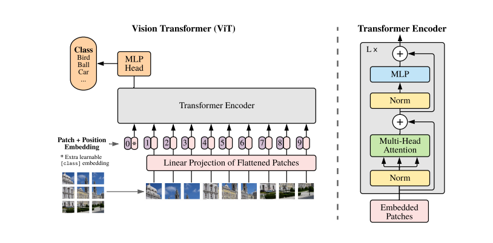

2010.11929

[https://github.com/google-research/transformer](https://github.com/
google-research/transformer)

# 摘要

我们证明了图像任务对CNN的依赖是不必要的，而一个直接应用于图像patches序列的纯Transformer可以很好地执行图像分类任务。与最先进的卷积网络相比，ViT获得了极好的结果，同时需要更少的计算资源来训练。

## 方法

在模型设计中，我们尽可能遵循原始变压器（Vaswani et al.，2017）。这种有意简单的设置的一个优点是，可伸缩的NLP变压器架构——及其高效的实现——几乎可以开箱即用

图1描述了该模型的概述。标准Transformer接收一个令牌嵌入的一维序列作为输入。处理二维图像，我们重塑图像$x∈R^{H×W×C}$一系列扁平的2D补丁$x_p∈R^{N×(P^2·C)}$，其中（H，W）是原始图像的分辨率，C是通道的数量，（P，P）是每个图像补丁的分辨率，$N=HW/P^2$产生的补丁，也作为变压器的有效输入序列长度。变压器使用不变的潜在向量大小D，所以我们将补丁变平，并通过可训练的线性投影映射到D维.我们将这个投影的输出称为补丁嵌入。

图1：我们把一个图像分成固定大小的补丁，将每个它们线性嵌入，添加位置嵌入，并将得到的向量序列提供给一个标准的Transformer encoder。为了进行分类，我们使用在序列中添加额外可学习“分类标记”的标准方法。

与BERT的[class]标记类似，我们在嵌入的补丁序列（$z^0_0 = x_{class}$）中准备了一个可学习的嵌入，其在变压器编码器（$z^0_L$）输出处的状态作为图像表示y.在训练前和微调过程中，一个分类头都被附加在$z^0_L$上。分类头由一个在训练前时间有一个隐藏层的MLP实现，在微调时由一个单一的线性层实现。

位置嵌入被添加到补丁嵌入中，以保留位置信息。我们使用标准的可学习的一维位置嵌入，因为我们没有观察到使用更先进的二维感知位置嵌入的显著性能提高。所得到的嵌入向量序列作为编码器的输入。

