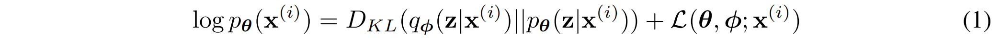

1312.6114v11

# 摘要

在定向概率模型中，在存在连续的潜在变量和棘手的后验分布的情况下，我们如何在大数据集中执行有效的推理和学习？我们引入了一种随机变分推理和学习算法，它可以扩展到大型数据集，在一些温和的可微性条件下，甚至可以在棘手的情况下工作。我们的贡献是双重的。首先，我们证明了变分下界的重新参数化产生了一个下界估计量，它可以直接使用标准的随机梯度方法进行优化。其次，我们展示了对于i.i.d.（独立同分布）对于每个数据点具有连续潜变量的数据集，通过使用所提出的下界估计量将近似推理模型（也称为识别模型）拟合到难以处理的后验模型上，可以使后验推理特别有效。实验结果反映在理论上的优势。

## 导言

我们如何使用连续的潜在变量和/或参数具有棘手的后验分布的有向概率模型来进行有效的近似推理和学习？变分贝叶斯（VB）方法涉及到对棘手的后验逼近的优化。不幸的是，一般的平均场方法需要期望w.r.t.的解析解近似的后验，在一般情况下也难以处理。我们展示了变分下界的重新参数化如何产生下界的一个简单的可微无偏估计量；这个SGVB（随机梯度变分贝叶斯）估计器可以用于几乎任何具有连续潜在变量和/或参数的模型的有效近似后验推理，并且可以直接使用标准的随机梯度上升技术进行优化。

对于一个i.i.d.的情况我们提出了自动编码VB（AEVB）算法。AEVB算法我们推理和学习尤其有效通过使用SGVB估计器优化识别模型，允许我们执行非常有效的近似后推理使用简单的祖先抽样，这反过来允许我们有效地学习模型参数，不需要昂贵的迭代推理方案（如MCMC）每个数据点。学习到的近似后验推理模型也可以用于识别、去噪、表示和可视化等一系列任务。当一个神经网络用于识别模型时，我们得到了变分自动编码器。

## Method

本节中的策略可用于推导各种具有连续潜变量的有向图形模型的下界估计量（一个随机目标函数）。我们将把我们自己限制在我们有一个i.i.d.（独立同分布）的常见情况下每个数据点具有潜在变量的数据集，其中我们喜欢对（全局）参数进行最大似然（ML）或最大后验（MAP）推理，并对潜在变量进行变分推理。直接将这个场景扩展到我们也对全局参数执行变分推理的情况；该算法放在附录中，但这种情况下的实验留给未来的工作。请注意，我们的方法可以应用于在线的、非平稳的设置，例如流媒体数据，但为了简单起见，这里我们假设有一个固定的数据集。

### Problem scenario

我们假设数据是由某个随机过程产生的，包括一个未观察到的连续随机变量z。该过程包括两个步骤：(1)一个值$z^{(i)}$由某些先验分布$p_{θ^∗}(z)$生成；(2)一个值$x^{(i)}$由某个条件分布$p_{θ^∗}(x|z)$生成。

非常重要的是，我们没有对边际概率或后验概率做出共同的简化假设。相反，我们在这里感兴趣的是一种通用算法，它甚至在以下情况下有效工作：

1. Intractability：边际似然的积分的情况$p_θ(x) =\int p_θ(z)p_θ(x|z)dz$是棘手的（所以我们不能评估或区分边际相似度），真正的后密度$p_θ(z|x)= p_θ(x|z)p_θ(z)/θ(x)$是棘手的（所以EM算法不能使用），以及任何合理的积分场VB算法也是棘手的。这些难性非常常见，出现在中等复杂的似然函数$p_θ(x|z)$的情况下，例如具有非线性隐层的神经网络。

2. A large dataset：我们有太多的数据，批优化成本太高；我们希望使用小批量甚至单个数据点进行参数更新。基于采样的解决方案，例如蒙特卡罗EM，通常会太慢，因为它涉及到每个数据点的一个通常昂贵的采样循环。

我们对上述场景中的三个相关问题很感兴趣，并提出了一个解决方案：

1. 对参数θ的有效近似ML或MAP估计。这些参数本身可能是有趣的，例如，如果我们正在分析一些自然过程。它们还允许我们模拟隐藏的随机过程，并生成与真实数据相似的人工数据。

2. 对于选择参数θ的潜变量z的有效近似后验推断。这对于编码或数据表示任务很有用。

3. 变量x的有效近似边际推断。这允许我们在需要先验超过x的情况下执行各种推理任务。计算机视觉的常见应用包括图像去噪、图像和超分辨率。

为了解决上述问题，让我们引入一个识别模型$q_φ(z|x)$：一个难以处理的真后验$p_θ(z|x)$的近似值。请注意，与平均场变分推理中的近似后验相比，它不一定是阶乘的，其参数φ也不是从某种封闭形式的期望中计算出来的。相反，我们将引入一种联合学习识别模型参数φ和生成模型参数θ的方法。

从编码理论的角度来看，未被观察到的变量z被解释为一个潜在的表示或代码。因此，在本文中，我们也将识别模型$q_φ(z|x)$称为概率编码器，因为给定一个数据点x，它会在数据点x可能生成的代码z的可能值上产生一个分布（例如一个高斯分布）。同样，我们将$p_θ(x|z)$称为概率解码器，因为给定一个代码z，它会在可能的相应值x上产生一个分布。

### The variational bound

边际似然由单个数据点$log p_θ(x^{(1)},...,x^{ (N)})= \sum\{i=1}^N log p_θ(x^ {(i)})$的边际似然的和组成，每个值可以重写为：

第一个RHS项是近似值与真实后验值的KL散度。由于这个kl散度是非负的，第二个RHS项$L(θ,φ;x ^{(i)})$被称为数据点i的边际似然上的（变分）下界ELBO，可以写成：

### The SGVB estimator and AEVB algorithm

### The reparameterization trick

## 采样

因为VAE拟合的是正态分布KL散度，直接做正态分布采样即可。

