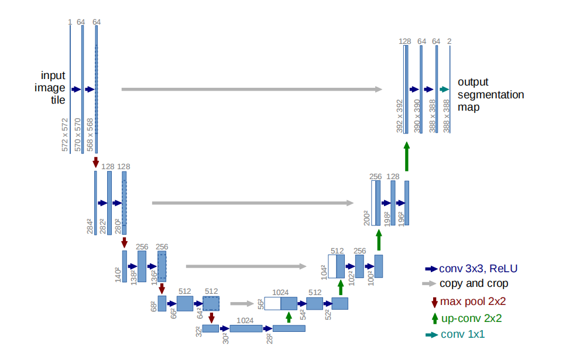

1505.04597v1

# 摘要

人们普遍认为，深度网络的成功训练需要数千个带注释的训练样本。在本文中，**我们提出了一种网络和训练策略，它依赖于强烈的数据增强来更有效地使用可用的注释样本。该体系结构由一个捕获上下文的收缩路径和能够实现精确定位的对称扩展路径组成。**我们证明，**这种网络可以从很少的图像中端到端训练**，并且在电子显微镜堆栈中神经元结构分割的ISBI挑战上优于先前的最佳方法（滑动窗口卷积网络）。使用在透射光显微镜图像（相位对比度和DIC）上训练的相同网络，我们在这些类别中大大赢得了2015年的ISBI细胞跟踪挑战。此外，这个网络的速度也很快。在最近的GPU上，512x512图像的分割只需要不到一秒。

## 导言

在过去的两年里，深度卷积网络在许多视觉识别任务中都表现出色，例如[7,3]。虽然卷积网络的[8]已经存在了很长一段时间，但由于可用的训练集的大小和所考虑的网络的大小，它们的成功受到了限制。K里热夫斯基等人[7]的突破是由于在具有100万张训练图像的ImageNet数据集上对一个具有8层和数百万个参数的大型网络进行监督训练。从那时起，更大、更深层次的网络就被训练成了[12]。

卷积网络的典型用途是在分类任务中，其中对图像的输出是一个单一的类标签。然而，在许多视觉任务中，特别是在生物医学图像处理中，所需的输出应该包括定位，即应该为每个像素分配一个类标签。此外，成千上万的训练图像在生物医学任务中通常遥不可及。因此，Ciresan等人[1]在滑动窗口设置中训练一个网络，通过在该像素周围提供一个局部区域（补丁）来预测每个像素的类标签作为输入。首先，这个网络可以进行本地化。其次，在斑块方面的训练数据远远大于训练图像的数量。由此产生的网络在2012年的ISBI大会上以巨大的优势赢得了EM分割挑战。

显然，Ciresan等人的[1]的策略有两个缺点。首先，它非常慢，因为网络必须为每个补丁单独运行，而且由于重叠的补丁，会有很多冗余。其次，在定位精度和上下文的使用之间存在一种权衡。更大的补丁需要更多的最大池化层，从而降低了定位精度，而小的补丁只允许网络看到很少的上下文。最近的方法[11,4]提出了一种考虑多层特征的分类器输出。良好的本地化和上下文的使用同时也是可能的。

在本文中，我们建立了一个更优雅的体系结构，即所谓的“全卷积网络”[9]。我们修改和扩展了这种体系结构，使它可以在很少的训练图像下工作，并产生更精确的分割；参见图1。[9]的主要思想是通过连续的层来补充通常的收缩网络，其中池化运营商被上采样运营商所取代。因此，这些层增加了输出的分辨率。为了定位，将收缩路径的高分辨率特征与上采样输出相结合。然后，一个连续的卷积层就可以学会根据这些信息来组装一个更精确的输出。

## U-Net架构

每个蓝框对应一个多通道特征图。通道的数量在方框的顶部表示。宽高的尺寸提供在盒子的左下边缘。白色的方框表示已复制的特征贴图。箭头表示不同的操作。

它由收缩路径（左侧）和膨胀路径（右侧）组成。收缩路径遵循卷积网络的典型架构。它包括重复应用两个3x3卷积（无填充卷积），每个卷积随后是一个校正线性单元（ReLU）和一个2x2最大池化操作，步幅为2用于下采样。在每一个降采样步骤中，我们都会将特征通道的数量增加一倍。扩展路径中的每一步都包括特征图的上采样，然后是2x2卷积（“上卷积”），将特征通道的数量减半，与收缩路径中相应裁剪的特征图的连接，以及两个3x3卷积，每个卷积都是一个ReLU。由于在每次卷积中都丢失边界像素，裁剪是必要的。在最后一层，使用1x1的卷积将每个64个分量的特征向量映射到所需的类的数量。该网络总共有23个卷积层。

