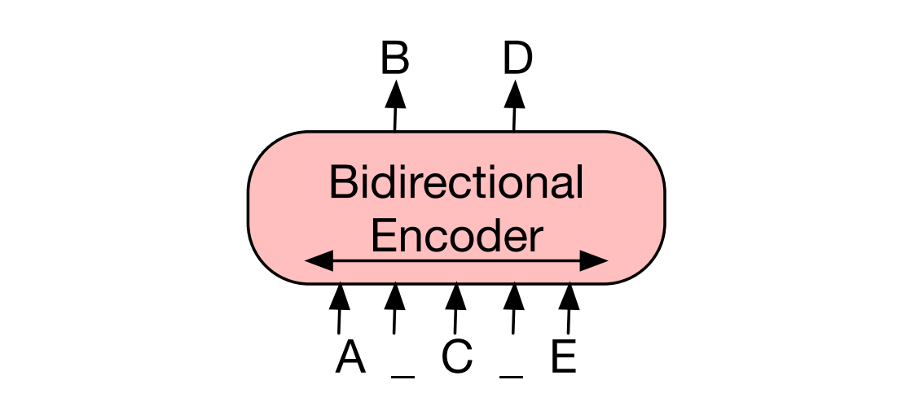
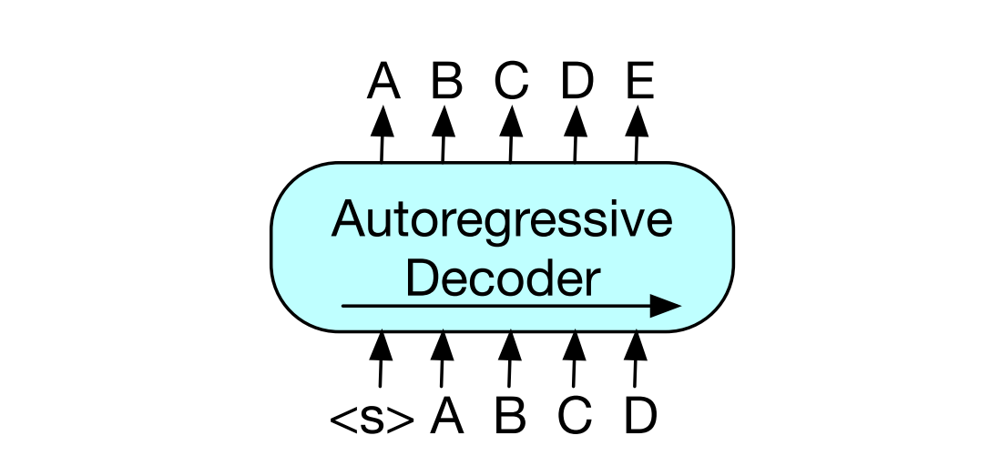
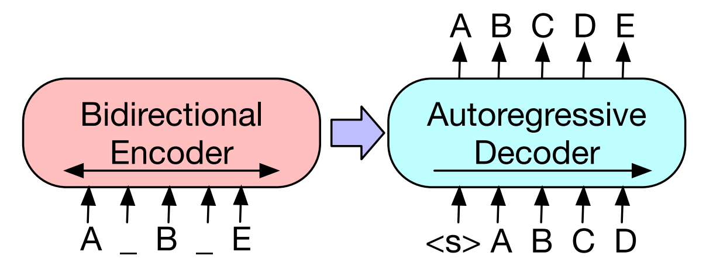

1910.13461v1

# 摘要

我们提出BART，一个预训练sequence-to-sequence的去噪自编码器模型。BART的训练方法是：(1)用任意的噪声函数破坏文本，(2)学习一个模型来重建原始文本。它使用了一个标准的基于转换器的神经机器翻译架构，尽管它很简单，但可以看作是推广BERT（由于双向编码器）、GPT（带有从左到右的解码器）和许多其他更新的预训练方案。我们评估了许多噪声方法，通过随机打乱原始句子的顺序和使用一种新的填充方案来找到最佳的性能，其中文本的跨度被替换为一个单一的掩码标记。BART在微调文本生成时特别有效，但对理解任务也很有效。它将RoBERTa的性能与GLUE和SQuAD上的培训资源相匹配，在一系列抽象对话、问题回答和总结任务上获得了新的最新结果，获得高达6个ROUGE。BART还为机器翻译提供了比反向翻译系统1.1的BLEU增加，只提供了目标语言的预训练。我们还报告了在BART框架内复制其他预训练方案的消融实验，以更好地衡量哪些因素对最终任务表现影响最大。

## 导言

(a) BERT：随机令牌被替换为掩码，并且文档被双向编码。缺失的令牌是独立预测的，因此BERT不能轻易地用于生成。

(b) GPT：令牌是自动回归预测的，这意味着GPT可以用于生成。然而，单词只能适应左向的上下文，所以它不能学习双向交互。

(c) BART：对编码器的输入不需要与解码器的输出对齐，允许任意噪声转换。在这里，文档由于用掩码符号替换文本跨度而损坏。损坏的文档（左）用双向模型进行编码，然后用自回归解码器计算原始文档（右）的可能性。对于微调，一个未损坏的文档被输入到编码器和解码器，我们使用来自解码器的最终隐藏状态的表示。

## Model

BART是一种去噪自动编码器，它将损坏的文档映射到其派生出来的原始文档。它被实现为一个序列到序列的模型与一个双向编码器在损坏的文本和一个从左到右的自回归解码器。对于预训练，我们优化了原始文档的负对数似然值。

### Architecture

BART使用了来自Transformer的标准序列到序列的转换器架构，除了，在GPT之后，我们将ReLU激活函数修改为GeLU，并从N（0,0.02）初始化参数。对于我们的基础模型，我们使用6层编解码器，对于我们的大型模型，我们在每个模型中使用了12层。该架构与BERT中使用的架构密切相关，有以下差异： (1)解码器的每一层额外对编码器的最后隐藏层执行交叉注意（如变压器序列到序列模型）；(2) BERT在单词预测之前使用了一个额外的前馈网络，而BART没有。总的来说，BART包含的参数比同等大小的BERT模型多10%。

### Pre-training BART

BART的训练是通过破坏文档，然后优化一个重建损失——解码器的输出和原始文档之间的交叉熵。与现有的去噪自动编码器不同，它是针对特定的噪声方案而定制的，BART允许我们应用任何类型的文件损坏。在极端情况下，关于源的所有信息丢失，BART相当于语言模型。

我们实验了几个先前提出的和新的转换，但我们相信开发其他新的替代方案有巨大的潜力。下面总结了我们使用的转换，其示例如图2所示

图2：我们实验的输入的转换。可以组合这些转换。

**Token Masking**：在BERT之后，随机令牌被采样并替换为[MASK]元素。

**Token Deletion：**从输入中删除随机标记。与令牌掩蔽相比，模型必须决定哪些位置缺少输入。

**Text Infilling：**许多文本跨度被采样，跨度长度来自泊松分布（λ = 3）。每个跨度都被替换为一个[MASK]标记。0个长度的跨度对应于[MASK]标记的插入。文本填充的灵感来自SpanBERT，但SpanBERT样本长度来自不同（夹紧几何）分布，并用完全相同长度的[MASK]标记序列替换每个跨度。文本填充教模型预测一个跨度中丢失了多少代币。

**Sentence Permutation：**一个文档被分为基于句号的句子，这些句子被随机打乱。

**Document Rotation：**均匀地随机选择一个标记，并旋转文档，使其以该标记开始。此任务将训练模型，以识别文档的开始位置。

## Fine-tuning BART

由BART产生的表示可以用多种方式用于下游应用程序。

### Sequence Classification Tasks

对于序列分类任务，将相同的输入输入编码器和解码器，将最终解码器令牌的最终隐藏状态输入新的多类线性分类器。这种方法与BERT中的CLS令牌有关；但是，我们在最后添加了额外的令牌，以便解码器中的令牌的表示就可以关注来自完整输入的解码器状态（图3a）。

(a)为了使用BART来处理分类问题，将相同的输入输入到编码器和解码器中，并使用来自最终输出的表示。

(b)对于机器翻译，我们学习了一个小的附加编码器，它可以替换BART中的单词嵌入。新的编码器可以使用不相交的词汇表。

图3：对分类和翻译的BART进行微调。

### Token Classification Tasks

对于令牌分类任务，如SQuAD的答案端点分类，我们将完整的文档输入编码器和解码器，并使用解码器的顶部隐藏状态作为每个单词的表示。此表示法用于对令牌进行分类。

### Sequence Generation Tasks

因为BART有一个自回归解码器，所以它可以直接对序列生成任务进行微调，如抽象的问题回答和摘要。在这两项任务中，信息都是从输入中复制出来的，但却是被操纵出来的，这与去噪训练前的目标密切相关。这里，编码器输入是输入序列，解码器自动回归生成输出。

### Machine Translation

我们还探索了使用BART来改进机器翻译译码器来翻译成英语。Edunov等人（2019）之前的工作表明，模型可以通过合并预先训练的编码器来改进，但在解码器中使用预先训练的语言模型获得的收益有限。我们表明，通过添加一组从双文中学习到的新的编码器参数，可以使用整个BART模型（包括编码器和解码器）作为机器翻译的单一预训练解码器（见图3b）。

更准确地说，我们用一个新的随机初始化的编码器替换了BART的编码器嵌入层。该模型是端到端训练的，它训练新的编码器将外来单词映射到一个BART可以消除英语噪声的输入中。新的编码器可以使用与原始BART模型不同的词汇表。

我们分两步训练源编码器，在这两种情况下，都是反向传播来自BART模型输出的交叉熵损失。在第一步中，我们冻结了大部分的BART参数，并且只更新了随机初始化的源编码器、BART位置嵌入和BART编码器第一层的自注意输入投影矩阵。在第二步中，我们为少量的迭代训练所有的模型参数。

