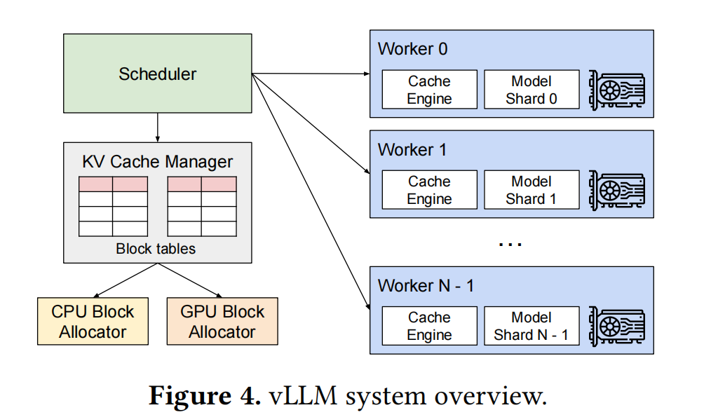

2309.06180v1

# 摘要

大型语言模型（llm）的高吞吐量服务需要一次批处理足够多的请求。然而，现有的系统都很困难，因为每个请求的键值缓存（KV缓存）内存都很大，并且会动态地增长和缩小。当管理效率低时，该内存可能会被碎片化和冗余重复严重浪费，从而限制了批处理的大小。为了解决这个问题，我们提出了一种分页注意算法，这是一种受经典的虚拟记忆和分页技术启发的注意算法。在此基础上，我们构建了vLLM，一个LLM服务系统，实现(1)在KV缓存中接近零浪费，(2)在请求内部和请求之间灵活地共享KV缓存，以进一步减少内存使用。我们的评估表明，与最先进的系统，如FasterTransformer和Orca相比，提高了LLMs的吞吐量2-4倍。随着更长的序列、更大的模型和更复杂的解码算法，改进更加明显。

## 导言

## 背景

## LLM服务内存挑战

## 方法（PagedAttention）

在这项工作中，我们开发了一个新的注意算法，PagedAttention，并建立了一个LLM服务引擎，vLLM，以解决在3中概述的挑战。vLLM的架构如图4所示。vLLM采用集中式调度器来协调分布式GPU工作人员的执行。KV缓存管理器以一种分页的方式有效地管理KV缓存，通过分页注意力启用。具体来说，KV缓存管理器通过集中式调度器发送的指令来管理GPU工作人员上的物理KV缓存内存。

### 4.1 PagedAttention

