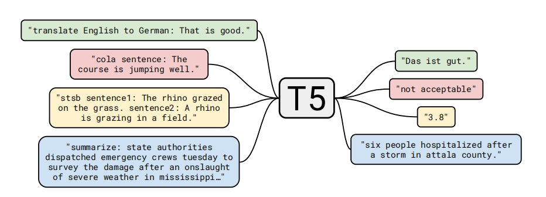
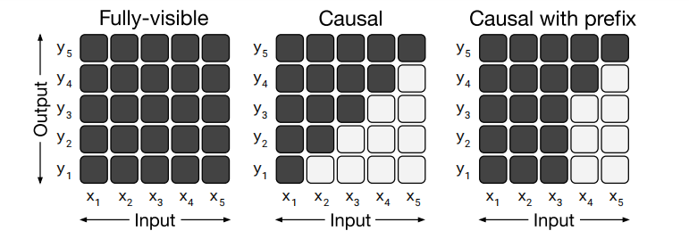
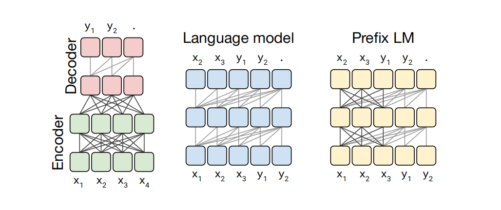
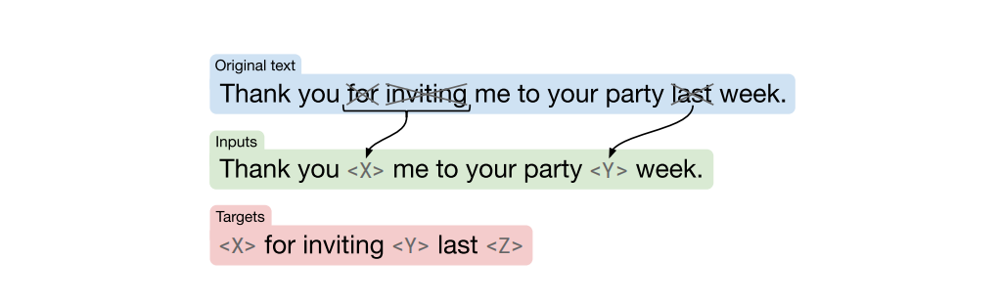
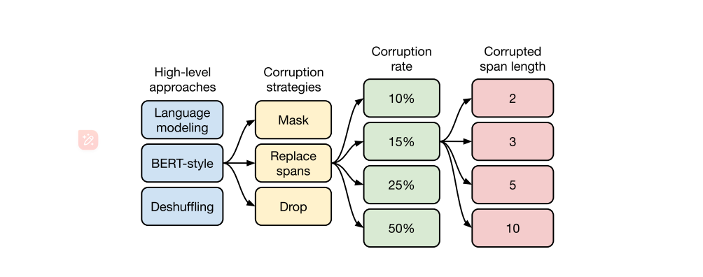

1910.10683

[https://github.com/google-research/text-to-text-transfer-transformer](https://github.com/google-research/text-to-text-transfer-transformer)

# 摘要

迁移学习，即模型首先在数据丰富的任务上进行预先训练，然后对下游任务进行微调，已经成为自然语言处理（NLP）中的一种强大的技术。迁移学习的有效性已经产生了多种方法、方法和实践。在本文中，**我们通过引入一个统一的框架，将所有基于文本的语言问题转换为文本到文本的格式，来探索自然语言处理的迁移学习技术的前景。**我们的系统研究比较了训练前的目标、架构、未标记的数据集、转移方法和数十个语言理解任务中的其他因素。通过将我们的探索与规模和我们新的“巨大的干净爬行语料库”相结合，我们在许多基准上实现了最先进的结果，包括摘要总结、问题回答、文本分类等。为了促进NLP迁移学习工作，我们发布了我们的数据集、预先训练的模型和代码。

## 导言

**我们工作的基本思想是将每一个文本处理问题都视为“文本到文本”的问题，即将文本作为输入，生成新的文本作为输出。**这种方法的灵感来自于之前针对NLP任务的统一框架，包括将所有文本问题转换为问答（McCann等人，2018年）、语言建模（Radford等人，2019年）或span extraction（跨度提取）Keskar等人（2019年b）任务。至关重要的是，文本到文本的框架允许我们直接将相同的模型、目标、训练过程和解码过程应用到我们所考虑的每一个任务中。我们通过利用这种灵活性来评估各种基于英语的自然语言处理问题的性能，包括问题回答、文档总结，和情感分类，等等。通过这种统一的方法，我们可以比较不同的迁移学习目标、未标记数据集和其他因素的有效性，同时通过扩展模型和数据集超出以前考虑的范围来探索迁移学习的局限性。

## 架构

一个我们的文本到文本框架的图表。我们考虑的每一个任务——包括翻译、问题回答和分类——都被转换为输入我们的模型文本作为输入，并训练它生成一些目标文本。这允许我们使用相同的模型、损失函数、超参数等。跨越我们的任务。"translate English to German: That is good."其中”“translate English to German“是任务，通过带有前缀的因果掩蔽实现。

### 代表不同注意力掩模模式的矩阵

代表不同注意力掩模模式的矩阵。自注意机制的输入和输出分别记为x和y。在第i行和第j列处的一个暗单元格表明，自注意机制被允许在输出时间步长i处注意输入元素j。光细胞表明自我注意机制不允许关注相应的i和j组合。

左：一个完全可见的掩模允许自我注意机制在每个输出时间步长关注完整的完整输入。

中间：因果掩码（causal mask）阻止第i个输出元素依赖于“未来”的任何输入元素。

右图：带有前缀的因果掩蔽（Causal masking with a prefix）允许自我注意机制在输入序列的一部分上使用完全可见的掩蔽。

我们所考虑的变压器架构变体的示意图。在这个图中，块表示序列中的元素，线表示注意的可见性。不同颜色的块组表示不同的变压器层堆栈。深灰色的线对应完全可见的掩蔽，浅灰色的线对应因果掩蔽。我们使用“.”表示预测结束的特殊序列结束标记。输入序列和输出序列分别用x和y表示。

左：一个标准的编码-解码器架构在编码器和编码-解码器注意中使用完全可见的掩蔽，在解码器中使用因果掩蔽。

中间：语言模型由单个变压器层堆栈组成，并使用输入和目标的连接。

右图：向语言模型中添加一个前缀对应于允许对输入进行完全可见的掩蔽。

### Unsupervised Objectives

我们在基线模型中使用的目标示意图。在这个例子中，我们处理了“Thank you for inviting me to your party last week”。单词“for”、“inviting”和“last”（用×标记）被随机选择为corruption。每个被损坏的标记的连续跨度都被一个哨兵token（标记）（显示为<X>和<Y>）所取代，它在示例中是唯一的。由于“for”和“inviting”连续发生，它们被一个哨兵<X>所取代。然后，输出序列由dropped-out spans组成，由用于在输入中替换它们的哨兵标记加上最终的哨兵标记<Z>分隔。

作为一个无监督的目标，我们将同时考虑一个基本的语言建模目标以及我们在第3.1.4节中描述的基线去噪目标。我们将语言建模目标作为预训练目标（Dai和Le，2015；拉马钱德兰等人，2016；霍华德和鲁德，2018；雷德福等人，2018；彼得斯等人，2018），以及它对我们所考虑的语言模型架构的自然匹配。对于在做出预测之前摄取一个前缀的模型（编码器-解码器模型和前缀LM），我们从未标记的数据集中采样一系列文本，并选择一个随机点将其分割为前缀和目标部分。对于标准语言模型，我们训练该模型从头到尾预测整个跨度。我们的无监督去噪目标是为文本到文本模型设计的；为了使其与语言模型一起使用，我们连接了输入和目标，如第3.2.1节中所述。

我们对无监督目标的探索的流程图。我们首先在第3.3.1节中考虑了一些不同的方法，并发现一个bert式的去噪目标表现最好。然后，我们在第3.3.2节中考虑了各种简化BERT目标的方法，使其产生更短的目标序列。考虑到用哨点标记替换退出的跨度表现良好，并导致较短的目标序列，在第3.3.3节中，我们用不同的腐败率进行了实验。最后，我们在第3.3.4节中评估了一个故意破坏连续标记跨度的目标。

### Corrupting Spans

我们现在转向通过预测较短的目标来加速训练的目标。到目前为止，我们使用的方法使i.i.d.决定每个输入令牌是否损坏它。当多个连续令牌被损坏时，它们被视为一个“跨度”，并使用一个唯一的掩码令牌来替换整个令牌。用单个标记替换整个跨度会导致未标记的文本数据被处理成更短的序列。因为我们在使用一个i.i.d.在腐败策略中，并不总是会有大量的腐败标记连续出现。因此，我们可能通过特别破坏标记的跨度而不是破坏i.i.d.中的单个标记来获得额外的加速方式腐蚀跨度以前也被认为是BERT的训练前目标，在那里它被发现可以提高表现。

为了验证这一想法，我们考虑了一个专门破坏连续的、随机间隔的标记跨度的目标。这个目标可以通过被损坏的令牌的比例和被损坏的跨度的总数来参数化。

## 总结 

- Transformer Encoder-Decoder 模型；

- BERT-style 式的破坏方法；

- Replace Span 的破坏策略；

- 15 %的破坏比；

- 3 的破坏时小段长度。

1. **Mask 法**，如现在大多模型的做法，将被破坏 token 换成特殊符如 [M]；

2. **replace span（小段替换）法**，可以把它当作是把上面 Mask 法中相邻 [M] 都合成了一个特殊符，每一小段替换一个特殊符，提高计算效率；**对大概3长度的小段进行破坏效果最好**

3. **Drop 法**，没有替换操作，直接随机丢弃一些字符。

