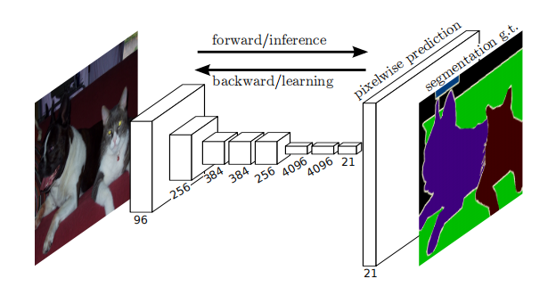
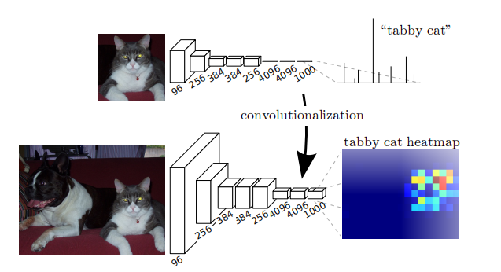

1411.4038v2

# 摘要

卷积网络是一种能够产生特征层次结构的功能强大的视觉模型。我们证明了卷积网络本身，训练端到端，像素到像素，超过了最先进的语义分割。我们的关键见解是建立“完全卷积”网络，该网络接受任意大小的输入，并通过有效的推理和学习产生相应大小的输出。我们定义并详细描述了全卷积网络的空间，解释了它们在空间密集的预测任务中的应用，并与之前的模型建立了联系。我们定义并详细描述了全卷积网络的空间，解释了它们在空间密集的预测任务中的应用，并与之前的模型建立了联系。我们将当代分类网络（AlexNet[19]，VGG net [31]和GoogLeNet [32]）调整为完全卷积网络，并通过微调将其学习到的表示转移到分割任务中。

## 导言

我们证明了一个完全卷积网络（FCN），训练端到端，像素到像素的语义分割，超过了至今为止最先进的算法。据我们所知，这是第一个训练FCNs端到端的，像素级预测和从有监督的预训练的工作。现有网络的完全卷积版本可以预测来自任意大小的输入的密集输出。通过密集前馈计算和反向传播对全图像时间进行学习和推理。网络内的上采样层能够在具有下采样池的网络中进行像素级预测和学习。

这种方法是有效的，渐近和绝对，并排除了其他工作的需要。分段训练是一种常见的[27,2,8,28,11]，但缺乏完全卷积训练的效率。**我们的方法没有利用预处理和后处理的复杂性**，包括超像素[8,16]，建议[16,14]，或随机域或局部分类器[8,16]的事后细化。我们的模型通过将分类网重新解释为完全卷积和微调的表示，将分类[19,31,32]最近的成功转移到密集预测中。相比之下，以前的工作应用了小凸网，没有监督的预训练[8,28,27]。

**语义分割面临着语义和位置之间的内在紧张关系：全局信息解决了什么，而局部信息解决了哪里**。深度特征层次结构在一个局部-全局金字塔中联合编码位置和语义。在第4.2节中，我们定义了一种新的“skip”体系结构，将深、粗、语义信息和浅、细、外观信息结合起来。

全卷积网络可以有效地学习对语义分割等每像素的任务进行密集的预测。

## Fully convolutional networks

凸网中的每一层数据都是一个大小为$h×w×d$的三维数组，其中h和w是空间维度，d是特征或信道维度。第一层是图像，像素大小为h×w和d为颜色通道。较高层次的位置对应于图像中它们被路径连接的位置，这被称为它们的接受域。

将fully connected层转换为convolution层，使分类网能够输出热图。添加图层和空间损失将生成一个实现端到端密集学习的高效机器。

