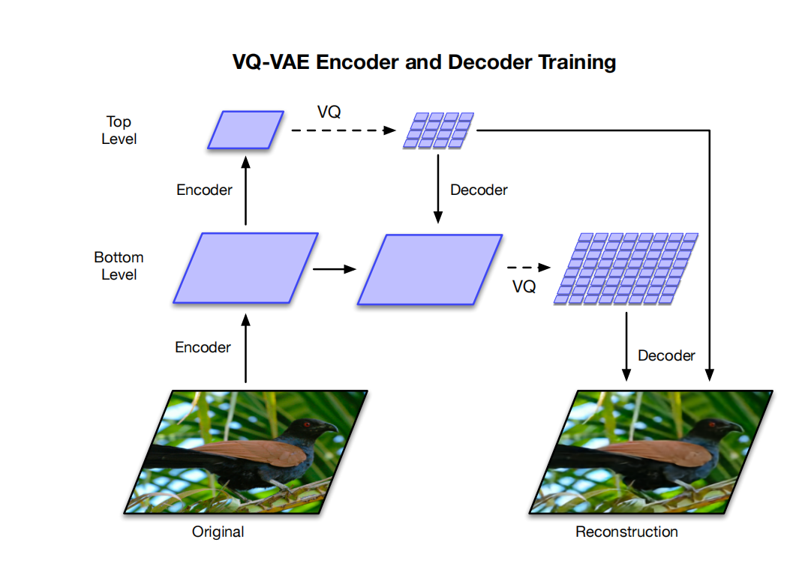
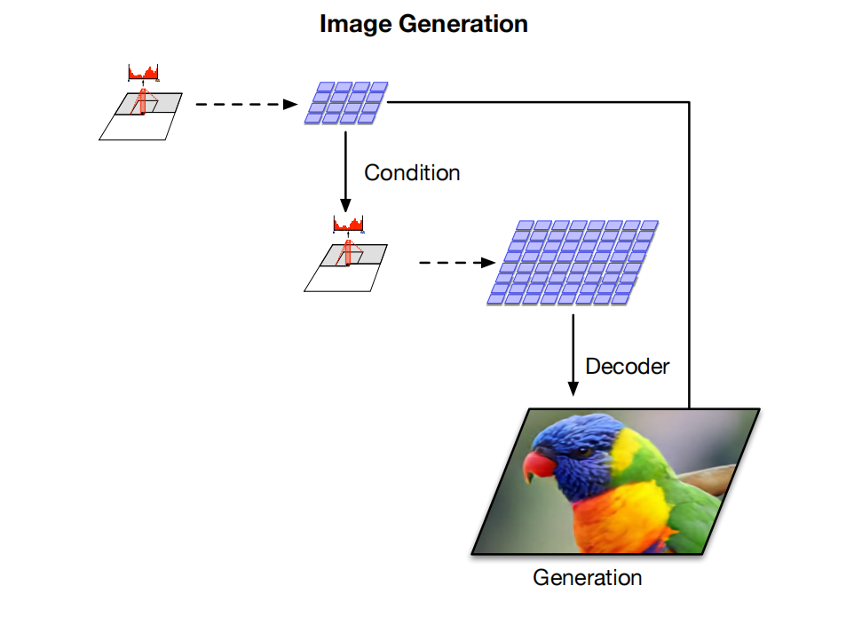
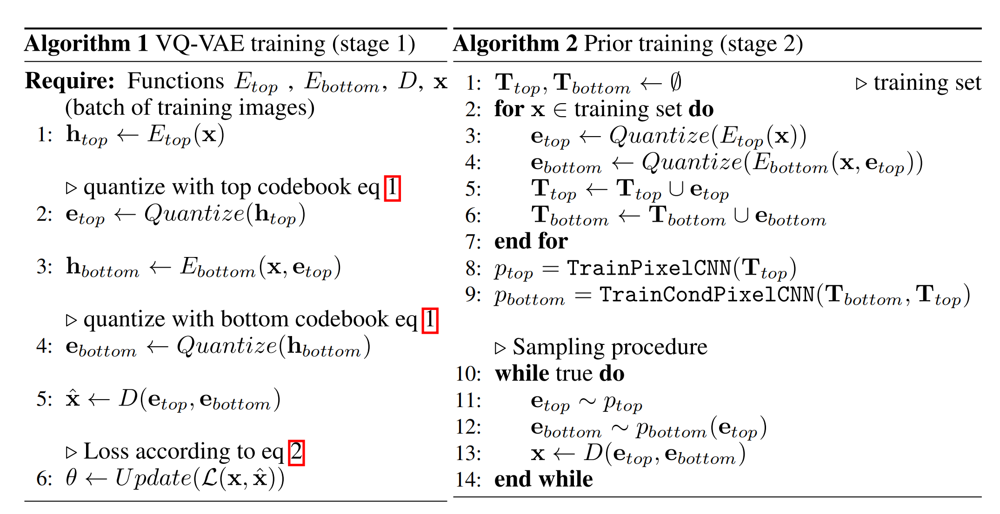

1906.00446v1

# 摘要

我们探索了使用矢量量化化的变分自动编码器（VQ-VAE）模型来进行大规模的图像生成。为此，我们扩展VQ-VAE中使用的自回归先验，以生成比以前更高的一致性和保真度的合成样本。我们使用简单的前馈编码器和解码器网络，使我们的模型成为编码/解码速度至关重要的应用程序的一个有吸引力的候选模型。此外，VQ-VAE只需要在压缩的潜在空间中对自回归模型进行采样，这比在像素空间中采样快一个数量级，特别是对于大图像。我们证明，在VQ-VAE的基础上添加对隐含码的强大先验，可以实现多尺度层次化组织，从而生成与当前最先进的生成对抗网络（GAN）在ImageNet等多维度数据集上相媲美的高质量样本，同时避免了GAN已知的缺点，如模式塌陷和缺乏多样性。

## 导言

深层生成模型在过去几年中有了显著的改进。这在一定程度上要归功于架构上的创新和计算方面的进步，这允许在数据量和模型规模上对它们进行更大规模的训练。这些模型生成的样本无需仔细检查，很难与真实数据区分开来，它们的应用范围从超分辨率[20]到域编辑[40]、艺术操作[32]，或文本到语音和音乐生成[22]。图1：来自于在ImageNet上训练的两级模型的类条件的256x256个图像样本。

我们区分了两种主要类型的生成模型：基于似然的模型，包括VAEs [15,28]、基于流的[8,27,9,16]和自回归模型[19,35]；和隐式生成模型比如生成式对抗网络（GANs）[11]。每个模型都提供了几种权衡，如样本质量、多样性、速度等。

GANs通过将随机噪声映射到图像上，通过生成器神经网络产生图像，并通过将其样本分类为真或假来定义生成器的损失函数。更大规模的GAN模型现在可以生成高质量和高分辨率的图像[4,13]。然而，众所周知，从这些模型中提取的样本并不能完全捕获真实分布的多样性。此外，GANs的评估具有挑战性，而且在测试集上还没有一个令人满意的泛化度量来评估过拟合。对于模型的比较和选择，研究人员使用了图像样本或图像质量的代理测量，如初始评分（IS）[30]和Frechet初始距离（FID）

相比之下，基于似然的方法优化了训练数据的负对数似然（NLL）。这个目标允许模型比较和测量对不可见数据的泛化。此外，由于模型分配给训练集中所有样本的概率是最大化的，基于似然的模型原则上涵盖了数据的所有模式，并且不存在在GANs中看到的模式崩溃和缺乏多样性的问题。尽管有这些优点，但直接最大化像素空间的可能性可能是具有挑战性的。首先，像素空间中的NLL并不总是样本质量[33]的良好度量，并且不能可靠地用于不同模型类之间的比较。这些模型没有关注全球结构的内在动机。其中一些问题可以通过引入归纳偏差，如多尺度[34,35,26,21]或通过建模图像中的主导位平面来缓解。

在本文中，我们使用有损压缩的思想来减轻生成模型建模可忽略的信息。事实上，JPEG [39]等技术已经表明，通常可以在不显著改变感知图像质量的情况下删除80%以上的数据。正如[37]所提出的那样，我们通过向量量化一个自动编码器的中间表示，将图像压缩到一个离散的潜在空间中。这些表示法比原始图像小30倍以上，但仍然允许解码器以很小的失真重建图像。这些离散表示的先验可以用最先进的PixelCNN [35,36]来建模，称为PixelSnail [6]。当从这个先验中采样时，解码后的图像也表现出同样的重建结果的高质量和相干性（见图1）。此外，在离散潜在空间上对该生成模型的训练和采样也比直接应用于像素时快30倍，这使我们能够在更高分辨率的图像上进行训练。最后，本工作中使用的编码器和解码器保持了原始VQ-VAE的简单性和速度，这意味着对于需要快速、低开销的大图像编码和解码的情况，该方法是一个有吸引力的解决方案。

## Method

该方法采用两阶段的方法：首先，我们训练一个层次的VQ-VAE将图像编码到一个离散的潜在空间上，然后我们在所有数据诱导的离散潜在空间上拟合一个强大的PixelCNN先验。

（a）我们的分层VQ-VAE的架构概述。编码器和解码器由深度神经网络组成。该模型的输入是一个256×256的图像，它分别被压缩为大小为64×64和32×32的量化潜在图。解码器从这两个潜在的映射中重建图像。

### Stage 1: Learning Hierarchical Latent Codes

与普通的VQ-VAE不同，在这项工作中，我们使用向量量化代码的层次结构来建模大型图像。这背后的主要动机是将局部信息，如纹理，与全局信息，如物体的形状和几何形状分开建模。因此，可以定制每个级别上的先验模型，以捕获该级别中存在的特定相关性。我们的多尺度层次编码器的结构如图2a所示，其中有一个顶部潜在代码来建模全局信息，以及一个底部潜在代码，以顶部潜在代码为条件，负责表示局部细节（见图3）。我们注意到，如果我们没有将底部潜设置在顶部潜层上，那么顶部潜就需要编码像素中的每一个细节。因此，我们允许层次结构中的每个级别分别依赖于像素，这鼓励在每个潜在映射中编码互补信息，这有助于减少解码器中的重构错误。详情请参见算法1。

（b）多级图像生成。顶级的PixelCNN先验以类标签为条件，底层的PixelCNN以类标签和第一级代码为条件。多亏了前馈译码器，延迟到像素之间的映射是快速的。（使用该模型生成带有鹦鹉的示例图像）。

### Stage 2: Learning Priors over Latent Codes

### Trading off Diversity with Classifier Based Rejection Sampling

