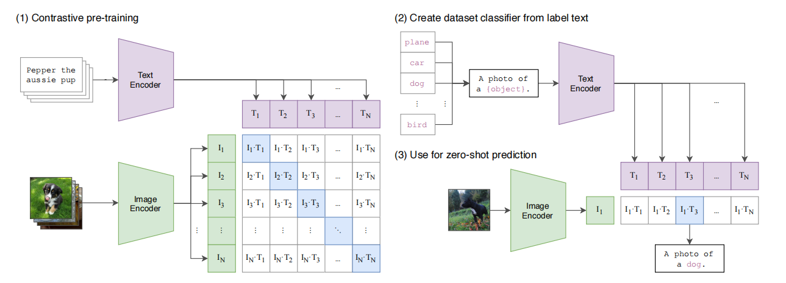

从自然语言监督中学习可迁移视觉模型（CLIP）

2103.00020

# 摘要

最先进的计算机视觉系统被训练来预测一组固定的预定的对象类别。这种受限的监督形式限制了它们的通用性和可用性，因为需要额外的标记数据来指定任何其他视觉概念。直接从原始文本中学习关于图像的知识是一种很有前途的选择，它利用了更广泛的监督来源。我们证明了简单的训练前任务，预测哪个标题与哪个图像是一种有效的和可伸缩的方法，从互联网收集的4亿（图像，文本）数据集学习SOTA图像表示。

### 方法总结



标准图像模型联合训练图像特征提取器和线性分类器来预测某些标签，

CLIP联合训练图像编码器和文本编码器来预测一批（图像、文本）训练示例的正确配对。

在测试时，学习到的文本编码器通过嵌入目标数据集的类的名称或描述来合成一个零镜头的线性分类器。

- text encoder： Transformer

- image encoder：ResNet / ViT

对于文本编码器，我们只缩放模型的宽度，使其与计算出的ResNet宽度的增加成正比，而根本不缩放深度，因为我们发现CLIP的性能对文本编码器的容量不那么敏感。

ViT-L/14@336px 模型效果最好。

### 计算图文匹配度（余弦相似度）

```Python
with torch.no_grad():
    image_features = model.encode_image(image_input).float()
    text_features = model.encode_text(text_tokens).float()
    
image_features /= image_features.norm(dim=-1, keepdim=True)
text_features /= text_features.norm(dim=-1, keepdim=True)
similarity = text_features.cpu().numpy() @ image_features.cpu().numpy().T
```

### Zero-Shot Image Classification

```Python
text_descriptions = [f"This is a photo of a {label}" for label in cifar100.classes]
text_tokens = clip.tokenize(text_descriptions).cuda()

with torch.no_grad():
    text_features = model.encode_text(text_tokens).float()
    text_features /= text_features.norm(dim=-1, keepdim=True)

text_probs = (100.0 * image_features @ text_features.T).softmax(dim=-1)
top_probs, top_labels = text_probs.cpu().topk(5, dim=-1)
```

