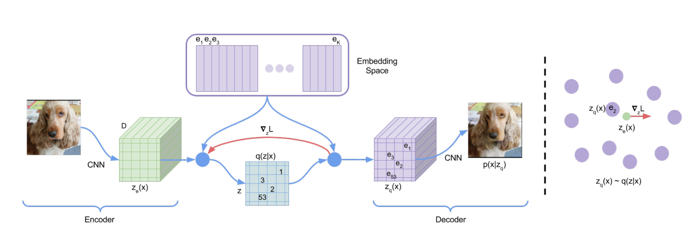
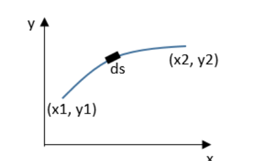

1711.00937v2

# 摘要

在没有监督的情况下学习有用的表示仍然是机器学习中的一个关键挑战。在本文中，我们提出了一个简单而强大的生成模型，以学习这种离散表示。我们的模型，矢量量化变分自动编码器（VQ-VAE），在两个关键方面不同于VAEs：**编码器网络输出离散的，而不是连续的代码；先验是学习的而不是静态的**。为了学习一个离散的潜在表示，我们结合了来自向量量化（VQ）的思想。使用VQ方法允许模型绕过“posterior collapse（后向崩溃）”的问题——在这个问题中，当它们与一个强大的自回归解码器配对时，latents会被忽略——这通常在VAE框架中观察到。将这些表示与自回归先验相结合，该模型可以生成高质量的图像、视频和语音，并进行高质量的扬声器转换和声素的无监督学习，为学习到的表示的实用性提供了进一步的证据。

## 导言

图像[38,12,13,22,10]、音频[37,26]和视频[20,11]的最新进展已经产生了令人印象深刻的样本和应用[24,18]。与此同时，具有挑战性的任务，如few-shot学习[34]、domain adaptation（领域自适应）[17]或强化学习[35]，很大程度上依赖于从原始数据中学习的表示，但以无监督方式训练的通用表示的有效性仍然远不是主导方法。

Maximum likelihood and reconstruction error（最大似然误差和重构误差）是在像素域中训练无监督模型的两个常见目标，但它们的有效性取决于这些特征所使用的特定应用。**我们的目标是实现一个模型，保留数据的重要特征的潜在空间，同时优化最大似然**。[7]的工作建议，最好的生成模型（通过对数似然值来测量）将是那些没有潜在模型，但具有强大的解码器的模型（如PixelCNN）。然而，在本文中，我们主张学习离散的和有用的潜在变量，我们在各种领域上证明。

学习具有连续特征的表示一直是[16,39,6,9]的许多以前工作的重点，但是我们专注于离散表示[27,33,8,28]，这可能是一个更自然的适合于我们感兴趣的许多模式。语言本质上是离散的，类似的语音通常被表示为一系列符号。图像通常可以用语言[40]来简明地描述。此外，离散表示是复杂推理、规划和预测性学习的自然适合物（例如，如果下雨，我将使用一把雨伞）。虽然在深度学习中使用离散潜在变量已被证明具有挑战性，但强大的自回归模型已被开发用于建模离散变量[37]上的分布。

在我们的工作中，我们引入了一个新的生成模型家族，通过给定观察的（离散）延迟的后验分布的新参数化，成功地将变分自编码器（VAE）框架与离散潜在表示相结合。我们的模型依赖于矢量量化（VQ），训练简单，不存在较大的方差，并避免了“后验塌陷”问题，这是许多具有强大解码器的VAE模型的问题，通常是由于latents被忽略造成的。此外，它是第一个获得性能与连续对应模型相似的离散潜在VAE模型，同时提供了离散分布的灵活性。我们把我们的模型称为VQ-VAE。

由于VQ-VAE可以有效地利用潜在空间，它可以成功地建模通常跨越数据空间的多个维度的重要特征（例如，对象跨越图像中的许多像素、语音中的音素、文本片段中的信息等）。而不是集中或花费能力在噪音和难以察觉的细节上，这通常是局部的。

最后，一旦VQ-VAE发现了一个良好的离散潜在结构，我们就在这些离散随机变量上训练一个强大的先验，产生有趣的样本和有用的应用。例如，当我们接受语音训练时，我们就发现了语言的潜在结构，而没有任何监督或对音素或单词的先验知识。此外，我们还可以为解码器配备说话人身份，这允许说话人转换，即在不改变内容的情况下，将声音从一个说话者转移到另一个说话者。我们还显示了在学习长期环境结构方面的有希望的结果。

因此，我们的贡献可以概括为：

- 引入VQ-VAE模型很简单，使用离散潜在模型，没有“posterior collapse（后验塌陷）”，也没有方差问题。

- 我们证明了一个离散潜在模型（VQ-VAE）在对数似然中表现与它的连续模型一样好。

- 当与强大的先验配对时，我们的样本在语音和视频生成等广泛的应用上都是高质量的，具有连贯性。

- 我们展示了通过原始语音学习语言的证据，没有任何监督，并展示了无监督的说话人转换的应用。

## 相关工作

## VQ-VAE

也许与我们的方法最相关的工作是vae。VAEs由以下部分组成：一个编码器网络，它参数化离散潜在随机变量z的后验分布$q(z|x)$，一个先验分布$p (z)$，以及一个在输入数据上具有分布$p(x|z)$的解码器。

通常，假设VAEs中的后验和先验与对角协方差呈正态分布，这允许使用高斯再参数化技巧[32,23]。扩展包括自回归先验和后验模型[14]、归一化流[31,10]和逆自回归后验[22]。

在这项工作中，我们引入了VQ-VAE，其中我们使用离散潜在变量与一种新的训练方式，启发来自向量量化（VQ）。后验分布和先验分布是分类的，从这些分布中抽取的样本索引了一个嵌入表。这些嵌入然后被用作解码器网络的输入。

### Discrete Latent variables（离散的潜在变量）

我们定义了一个潜在嵌入空间$e∈R^{K×D}$，其中K是离散潜在空间的大小（即K路分类），D是每个潜在嵌入向量$e_i$的维数。注意，有K个嵌入向量$e_i∈R^D，i∈1,2,...,K$。如图1所示，该模型接受一个输入x，该输入通过一个编码器产生输出$z_e(x)$。然后，使用共享的嵌入空间e，通过最近邻查找来计算离散的潜变量z，如式1所示。解码器的输入为相应的嵌入向量$e_k$，如式2所示。我们可以把这个正向计算管道看作是一个具有特定非线性的常规自动编码器，它将映射到1-k的隐嵌入向量。模型的完整参数集是编码器、解码器和嵌入空间e的参数并集。为了简单起见，我们在本节中使用一个随机变量z来表示离散的潜在变量，但是对于语音、图像和视频，我们实际上分别提取了一维、二维和三维潜在特征空间。

后验分类分布$q(z|x)$概率定义为一one-hot概率如下：

其中，$z_e(x)$是编码器网络的输出。我们把这个模型看作是一个VAE，其中我们可以用ELBO绑定$logp(x)$。我们的建议$q(z = k|x)$分布是确定性的，通过定义z上的一个简单的统一先验，我们得到了一个KL散度常数，并且等于$log K$

表示$z_e(x)$通过离散化瓶颈，然后映射到嵌入e的最近元素，如方程1和2。

### Learning

注意，对于方程2没有定义真实的梯度，但是我们近似于直接估计器[3]的梯度，只是将梯度从解码器输入$z_q (x)$复制到编码器输出$z_e (x)$。我们也可以通过量化操作来使用次梯度，但这个简单的估计器在本文的初始实验中很有效。

图1：左图：描述VQ-VAE的图。右图：嵌入空间的可视化。编码器$z(x)$的输出被映射到最近的点$e_2$。梯度$∇_zL$（红色部分）将推动编码器改变其输出，这可能会改变下一个向前传递的配置。

公式3指定了总体损失函数。它有三个组件，用于训练VQ-VAE的不同部分。

第一项是重构损失（或数据项），它优化了解码器和编码器（通过上面解释的估计器)。由于从$z_e (x)$到$z_q (x)$的映射的直接梯度估计，嵌入$e_i$没有从重构损失$log p(z|z_q (x))$中接收到梯度。

因此，为了学习嵌入空间，我们使用了最简单的字典学习算法之一，向量量化（VQ）。VQ目标使用$l_2$误差将嵌入向量$e_i$移动到编码器输出的$z_e (x)$，如方程3的第二项所示。因为这个损失项只用于更新字典，所以也可以更新字典项作为$z_e (x)$的移动平均值的函数。

最后，由于嵌入空间的体积是无量纲的，如果嵌入$e_i$的训练速度不如编码器参数快，它可以任意增长。为了确保编码器提交到一个嵌入中，并且其输出不会增长，我们添加了一个承诺损失，即公式3中的第三项。因此，总的培训目标就会变为：

其中，sg代表停止梯度算子，它在正向计算时被定义为恒等式，其偏导数为零，从而有效地约束其操作数为一个非更新常数。解码器只优化第一个损失项，编码器优化第一个损失项和最后一个损失项，embeddings将通过中间损失项进行优化。我们发现所得到的算法对β相当鲁棒，因为β值从0.1到2.0的结果没有变化。我们在所有的实验中都使用β = 0.25，尽管一般来说这取决于重建损失的规模。由于我们假设z有一个均匀的先验，所以通常出现在ELBO中的KL项是常数w.r.t.编码器的参数，因此可以被忽略，以进行训练。

### Prior

离散隐$p (z)$上的先验分布是一个分类分布，可以通过依赖特征图中的其他z进行自回归。在训练VQ-VAE时，先验值保持不变和统一。经过训练后，我们拟合了z，$p (z)$上的自回归分布，这样我们就可以通过祖先抽样生成x。我们在对图像的离散延迟上使用PixelCNN，对原始音频使用WaveNet。联合训练先验和VQ-VAE，可以加强我们的研究结果，作为未来的研究。

# 注

## posterior collapse（后验塌陷）

在贝叶斯模型世界（如VAE，pPCA），所担心的不是神经网络的“梯度消失”或“梯度爆炸”，而是“后验失效”(posterior collapse)现象。本质上，任何模型（传统或非传统）都要从每个新样本“汲取信息”，更新自身。当信息无法汲取并用来更新模型，就会出现上述问题。相对比较晦涩，简单来说就是 z的生成已经摆脱了前边encoder的影响，然后z直接输出一个或多个从大部分样本总结出来的几种模式。**该模型最终只依赖于解码器的自回归特性，而忽略了潜在变量，这变得无信息。**

## Latent Variable

隐变量是指通过模型从观测数据中推断出来的变量。比如，我们将一个输入对象送入一个神经网络的编码层(Nerual Network Encoder, NN-Encoder)，得到的由隐含层输出的向量就可以称作 latent variable。

## Variations

Variations，即变分法。在简述变分之前我们应该了解什么是泛函？回顾下从小到大我们所学习过的函数，它是将一个给定的输入数值x，经过一系列的变化f(x)，从而得到输出数值y。注意这里我们输入的是一个数，输出的也是一个数。那有没有这种情况，如果我们的自变量是一个函数而不是一个数值？最经典的问题便是，给定两个定点A和B，我们从A点可以经过任意一条路径到达B点，求在什么样的路径下使得A点到B点的时间最短？到这里大多数人都有答案了——两点之间直线段最短。像这种输入变量是一个函数，输出变量是一个数值的函数，称为泛函。泛函通俗点理解就是函数的函数。

针对下图，我门先求出点A(x1, y1)到点B(x2, y2)之间任意路径长度的表达式。任取一小段微元，根据勾股定理我们可以得出：$ds^2=dx^2+dy^2$，其中我们将这条曲线定义为$y=y(x)$。现在让我们对函数y进行求导，可以得到：$dy=dx\cdot y'$，我们将其带入到第一条公式，然后公式左右两边同时开方，可以得到：$ds=\sqrt{1+(y')^2}dx$，到这里我们便求出了一小段微元的长度了。接下来我们只将对x1到x2区间内所有的微元段累加起来便能得到总的路径长度为：

在上面的式子中， L便是一个泛函。其中被积函数$\sqrt{1+(y')^2}dx$  我们称为 Lagrange Function，即拉格朗日函数F 。现在我们的任务便是要寻找一个合适的函数 $y(x)$ 使得泛函 L 的取值最小。

