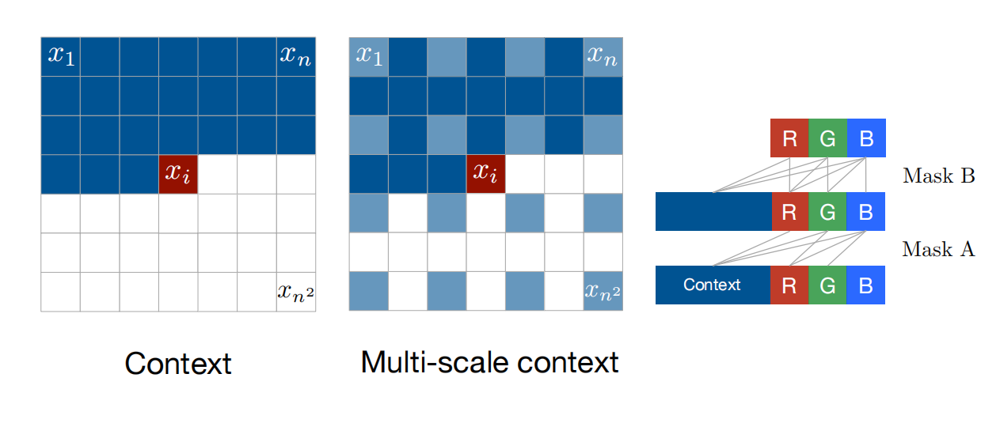
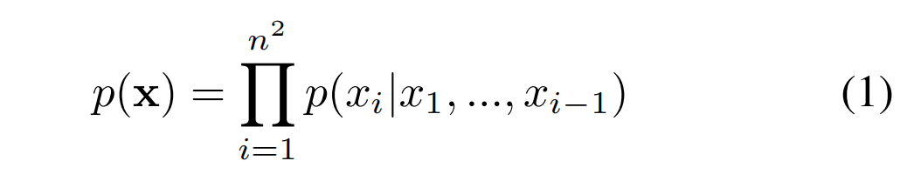
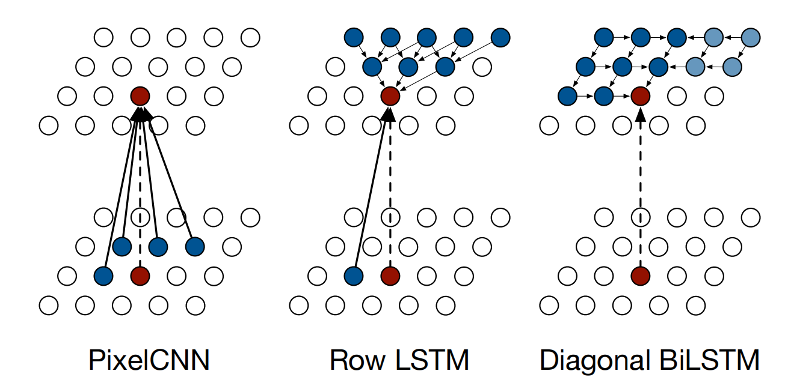
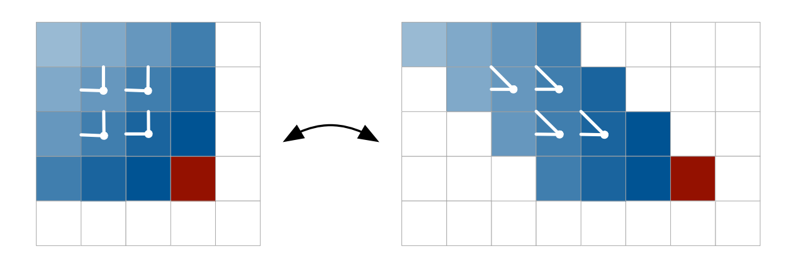
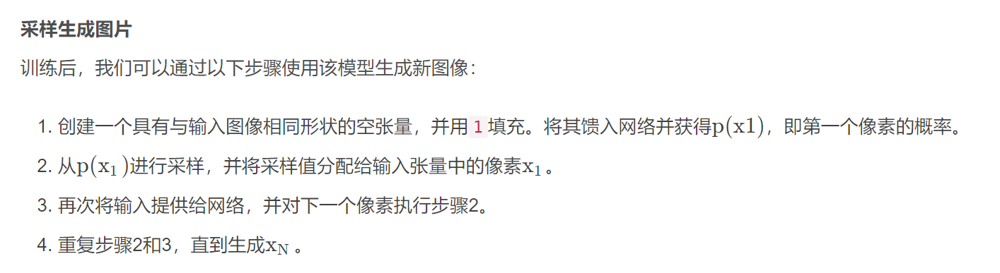

1601.06759v3

# 摘要

对自然图像的分布进行建模是无监督学习中的一个里程碑问题。这个任务需要一个同时具有表现力、易于处理和可伸缩性的图像模型。我们提出了一个深度神经网络，顺序预测图像的像素沿两个空间维度。我们的方法建模了原始像素值的离散概率，并编码了图像中完整的依赖集。建筑上的新特性包括快速二维循环层和在深度循环网络中有效利用剩余连接。我们在自然图像上获得了对数似然分数，这比之前的技术水平要好得多。我们的主要结果还提供了关于不同的ImageNet数据集的基准测试。从模型中生成的样本显得清晰、变化和全局连贯。

## 导言

本文提出了二维RNNs并将其应用于自然图像的大规模建模。生成的PixelRNNs由多达12个快速二维长短期记忆（LSTM）层组成。这些层使用其状态下的LSTM单元，并采用卷积一次计算数据的一个空间维度上的所有状态。我们设计了这两种类型的图层。第一种类型是Row LSTM层，其中沿着每一行应用卷积；在（Stollenga et al.，2015）中描述了类似的技术。第二种类型是DiagonalBiLSTM层，其中卷积沿着图像的对角线以一种新的方式应用。该网络还包括了LSTM层周围的残余连接（He et al.，2015）；我们观察到，这有助于训练PixelRNN进行多达12层的深度。

我们还考虑了第二种简化的架构，它与PixelRNN共享相同的核心组件。我们观察到，卷积神经网络（CNN）也可以作为一个具有固定依赖范围的序列模型，通过使用屏蔽卷积。PixelCNN架构是一个由15层组成的完全卷积网络，它在整个层中保持其输入的空间分辨率，并在每个位置输出一个条件分布。

PixelRNN和PixelCNN都捕获了像素相互依赖的完全通用性，而没有引入独立性假设，如潜在变量模型。在每个单独的像素内的RGB颜色值之间也保持着依赖关系。此外，与之前将像素建模为连续值的方法相比，我们使用一个简单的softmax层实现的多项分布将像素建模为离散值。我们观察到，这种方法为我们的模型提供了代表性和训练优势。

本文的贡献如下。在第3节中，我们设计了两种类型的Pixel LSTM层；我们描述了纯卷积PixelCNN，这是我们最快的架构；我们设计了一个多尺度版本的PixelRNN。在第5节中，我们展示了在我们的模型中使用离散的softmax分布和对LSTM层采用剩余连接的相对好处。接下来，我们在MNIST和CIFAR-10上测试了模型，并表明它们获得的对数似然分数比以前的结果要好得多。我们还提供了将大规模ImageNet数据集调整到32×32和64×64像素的结果；据我们所知，生成模型的似然值以前没有在这个数据集上报道过。最后，我们对Pixelrnn生成的样本进行了定性评价。

## Model

我们的目标是估计一个在自然图像上的分布，可以用来有把握地计算图像的可能性和生成新的图像。网络每次扫描一行，每一行扫描一个像素。对于每个像素，它预测在给定扫描上下文的可能像素值上的条件分布。图2说明了这个过程。在图像像素上的联合分布被分解为条件分布的乘积。在预测中使用的参数在图像中的所有像素位置上共享。



图2.**左**：生成像素$x_i$的条件需要$x_i$左和上方的所有像素。**中心**：为了在多尺度的情况下生成一个像素，我们还可以对下采样的图像像素（浅蓝色）进行条件。**右图**：一个掩蔽卷积内部的连通性图。在第一层中，每个RGB通道都连接到以前的通道和上下文，但没有连接到它自身。在随后的层中，通道也与自己连接。

为了捕捉生成过程，建议使用一个二维LSTM网络，该网络从左上角像素开始，然后向右下角像素移动。LSTM网络的优点是，它可以有效地处理对对象和场景理解非常重要的远程依赖关系。二维结构确保了信号在从左到右和从上到下两个方向上的良好传播。

在本节中，我们首先关注分布的形式，而下一节将致力于描述PixelRNN内部的架构创新。

### Generating an Image Pixel by Pixel

目标是为每个由n×n个像素组成的图像×分配一个概率$p(x)$。我们可以把图像x写成一个一维序列$x_1,...,x_{n^2}$，其中像素被逐行地从图像中提取。为了估计联合分布$p (x)$，我们将其写成像素上的条件分布的乘积：



请注意，在训练和评估过程中，像素值上的分布是并行计算的，而图像的生成则是按顺序计算的。

### Pixels as Discrete Variables

以前的方法对图像中的像素值使用连续分布。相比之下，我们将$p (x)$建模为一个离散分布，方程2中的每个条件分布都是一个用softmax层建模的多项式分布。每个通道变量$x_{i,∗}$只取256个不同的值中的一个。离散分布表示简单，具有任意多模态的优点，不预先考虑形状（见图6）。在实验中，我们还发现离散分布与连续分布相比易于学习，并产生更好的性能（第5节）。

## Pixel Recurrent Neural Networks

在本节中，我们将描述组成PixelRNN的架构组件。在第3.1节和第3.2节中，我们描述了两种类型的LSTM层，它们使用卷积一次计算沿着其中一个空间维度的状态。在第3.3节中，我们描述了如何合并残差连接来改进具有多个LSTM层的PixelRNN的训练。在第3.4节中，我们描述了计算颜色的离散联合分布的softmax层和确保适当的条件反射方案的掩蔽技术。在第3.5节中，我们描述了PixelCNN体系结构。最后，在第3.6节中，我们描述了多尺度的体系结构。

### Row LSTM

原始LSTM是一个单向层，一行一行地处理图像，一次处理整行的计算特征；计算采用一维卷积进行。对于像素$x_i$，图层捕获了像素上方的一个大致三角形的上下文，如图4（中心）所示。当k≥3时，一维卷积核的大小为k × 1；k的值越大，所捕获的上下文范围就越广。卷积中的权值共享保证了计算特征沿每一行的平移不变性。



### Diagonal BiLSTM

Diagonal  BiLSTM被设计为并行化计算，并捕获任何图像大小的整个可用上下文。每个图层的两个方向都以对角线的方式扫描图像，从顶部的一个角开始，再延伸到底部的另一个角。计算中的每一步都是沿着图像中的一条对角线一次计算LSTM状态。图4（右）说明了计算结果和由此产生的接受域。



图3.在Diagonal BiLSTM中，为了允许沿对角线进行平行化，输入映射会使每一行偏离一个位置。当从左到右逐列计算空间层时，输出贴图将被移回原始大小。卷积使用了一个大小为2×1的内核。

### Residual Connections

### Masked Convolution

### PixelCNN

Row and Diagonal LSTM层在它们的接受域内有一个潜在的无限依赖范围。这伴随着计算代价，因为每个状态都需要按顺序计算。一个简单的解决方法是让接受域变大，但不是无限的。我们可以使用标准的卷积层来捕获一个有界的接受域，并一次计算所有像素位置的特征。PixelCNN使用多个卷积层来保持空间分辨率；不使用池化层。在卷积中采用Masks，以避免看到未来的背景；Masks以前也被用于非卷积模型，如MADE。请注意，PixelCNN相对于PixelRNN的并行化的优势仅在训练或对测试图像的评估期间可用。对于这两种网络，图像生成过程都是连续的，因为每个采样像素都需要作为输入返回网络。

### Multi-Scale PixelRNN

Multi-Scale PixelRNN由一个无条件的PixelRNN和一个或多个有条件的PixelRNN组成。无条件网络首先以标准的方式生成较小的$s×s$图像，从原始图像下采样。然后，条件网络将$s×s$图像作为一个额外的输入，并生成一个更大的n×n图像，如图2（中）所示。

## 推理



```Python
sample.fill_(0)
net.train(False)
for i in range(28):
    for j in range(28):
        out = net(Variable(sample, volatile=True))
        probs = F.softmax(out[:, :, i, j]).data
        sample[:, :, i, j] = torch.multinomial(probs, 1).float() / 255.
utils.save_image(sample, 'sample_{:02d}.png'.format(epoch), nrow=12, padding=0)
```

