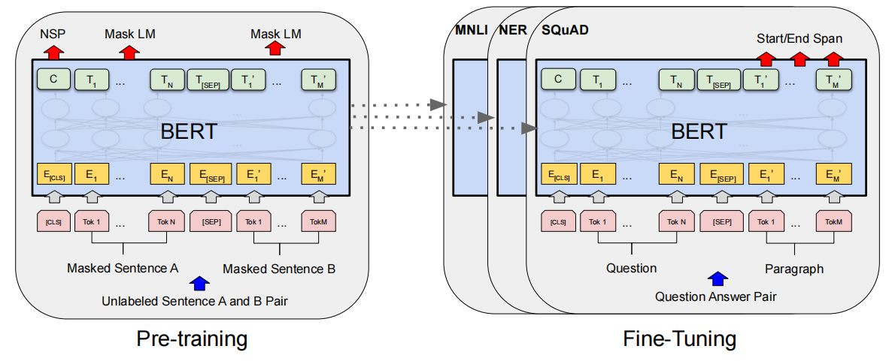
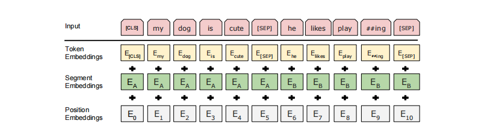

1810.04805

BERT（Bidirectional Encoder Representations from Transformers）Transformers的双向编码器表示

# 摘要

BERT的设计目的是通过在所有层中联合调节左右上下文，从未标记的文本中预训练深度双向表示。因此，预先训练过的BERT模型可以通过一个额外的输出层来进行微调，从而为广泛的任务创建最先进的模型，如问题回答和语言推理，而不需要实质性的任务特定的体系结构修改。

## 介绍

”masked language model“(MLM)从输入中随机屏蔽一些标记，其目标是预测掩蔽的原始词汇表id。仅根据其上下文。与left-to-right语言模型预训练不同，MLM目标使表示能够融合左右上下文，这使我们能够对深度双向Transformer进行预训练。除了MLM，我们还使用了一个“next sentence prediction”任务（联合预训练文本对表示）。

- BERT使用MLM来实现预训练的深度双向表示。

- BERT是第一个基于微调的表示模型，它在大型句子级和标记级任务上实现了最先进的性能，性能优于许多特定于任务的架构

现有有两种策略可以将预先训练好的语言表示应用于下游任务：

- feature-based（例如：ELMo）：使用特定于任务的架构，其中包括预先训练过的表示作为附加特性。

- fine-tuning（例如：GPT）：引入最小的特定于任务的参数，并通过简单地微调所有预先训练好的参数来在下游任务上进行训练

## BERT

我们将在本节中介绍BERT及其详细的实现。在我们的框架中有两个步骤：pre-training and fine-tuning。在预训练过程中，该模型在不同的预训练任务上对未标记的数据进行训练。为了进行微调，首先使用预先训练好的参数初始化BERT模型，并使用从下游任务中获得的标记数据对所有参数进行微调。每个下游任务都有单独的微调模型，即使它们是用相同的预训练参数初始化的。图1中的问答示例将作为本节的一个运行示例。

对BERT的整体pre-training和fine-tuning，除了输出层之外，在预训练和微调中都使用了相同的架构。相同的预训练模型参数用于初始化不同的下游任务的模型。在微调期间，所有参数都会进行微调。

- [CLS]是添加在每个输入示例前面的一个特殊符号，

- [SEP]是一个特殊的分隔符令牌（分离问题和答案）

### 特点

BERT变压器使用双向的自我注意，而GPT变压器使用受限的自我注意，其中每个令牌只能关注其左边的上下文。

### 模型架构

BERT的模型架构是一个多层双向Transformer encoder

$BERT_{BASE}$ (L=12, H=768, A=12, Total Parameters=110M)

- L：Transformer blocks

- H：hidden size

- A：self-attention heads

### 输入输出表示

BERT的一个显著特点是它跨不同任务的统一架构。预先训练好的体系结构和最终的下游体系结构之间的差别很小。一个“句子”可以是一个连续文本的任意跨度，而不是一个实际的语言句子。“序列”指的是对BERT的输入标记序列，它可以是单个句子或两个句子打包在一起。

### 预训练BERT

#### task1：Masked LM

为了训练一个深度双向表示，我们简单地随机屏蔽一些百分比的输入标记，然后预测这些掩蔽标记。我们将这个过程称为“masked LM”（MLM）

虽然这允许我们获得一个双向的预训练模型，但缺点是我们在预训练和微调之间创建了一个不匹配，因为[MASK]令牌在微调期间不会出现。在实现掩码任务时，需要遮掩的字只占语料全体的字数的一小部分(15%)；在这15%里面：

- 一部分（80%）被遮掩,也就是替换为[MASK];

- 一部分（10%）随机替换为其他词(仍然需要预测此处的token应该是什么);

- —部分（10%）保留原词(仍然需要预测此处的token);

#### task2：Next Sentence Prediction (NSP)

许多重要的下游任务，如问题回答（QA）和自然语言推理（NLI），都是基于对两个句子之间的关系的理解。当为每个预训练的示例选择句子A和B时，50%的时间B是A后面的实际下一个句子（标记为IsNext），50%的时间B是语料库中的随机句子（标记为NotNext）。如图1：C用于下一个句子预测（NSP）。（AB预测的是否是句子对，C预测的是是否下一句）

