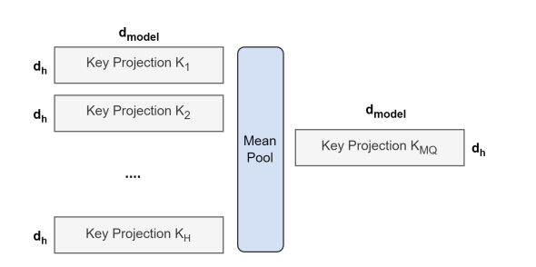

2305.13245v3

# 摘要

Multi-query attention（MQA）只使用一个键值头，大大加快了解码器推理。然而，MQA可能导致质量下降，而且不为了更快的推断而训练一个单独的模型。我们提出了一个方法，

1. 将现有的多头语言模型检查点升级成MQA模型，

2. 引入分组查询注意（GQA），一种多查询注意的泛化，使用一个中间（多于一个，少于查询头数量）的键值头。

我们表明，向上训练的GQA以接近MQA的速度达到接近多头注意力的质量。

## 导言

自回归解码器推理是Transformer模型的一个严重瓶颈，因为加载每个解码器权值和所有注意键和值的内存带宽开销。通过multi-query attention，可以显著降低加载keys和values的内存带宽，它使用多个query头，但使用单个keys和values头。然而，multi-query attention（MQA）可能会导致质量下降和训练不稳定，而训练针对质量和推理进行优化的单独模型可能是不可行的。此外，虽然一些语言模型已经使用了multi-query attention，如PaLM，但许多语言模型并没有使用，包括公开可用的语言模型，如T5和LLaMA。

这项工作包含了对使用大型语言模型进行更快的推理的两个贡献。

首先，研究表明具有多头注意（MHA）的语言模型检查点可以被向上训练，以使用具有一小部分原始训练计算的MQA。这是一种获得fast multi-query和高质量MHA检查点的经济有效的方法。

其次，我们提出了分组查询注意（GQA），这是一种在多头和多查询注意之间的插值，使用单键和值头。我们表明，向上训练的GQA可以达到了接近多查询注意力的质量，同时几乎与多查询注意力一样快。

## Uptraining

从multi-head model生成multi-query model分两个步骤进行：

- 首先，转换检查点，

- 其次，进行额外的预训练，以使模型适应其新的结构。

图1显示了将multi-head checkpoint转换为multi-query checkpoint的过程。key 和 value头的投影矩阵被mean-pooling（平均池化）成单个投影矩阵，我们发现这比选择单个键和值头或随机初始化新的key 和 value头更有效。

然后在相同的预训练方法上对转换后的检查点进行原始训练步骤的小比例α的预训练。

从multi-head到multi-query attention的转换概述。来自所有head的Key和value投影矩阵被平均合并到单个头部中。

## Grouped-query attention

分组查询注意力将查询头分为G组，每个组共享一个键头和值头。GQA-G是指使用G组进行的分组查询。GQA-1为单组，因此单Key和Value头，相当于MQA，而GQA-H组等于头数，相当于MHA。图2显示了分组查询注意力和多头/多查询注意力的比较。当将一个多头检查点转换为一个GQA检查点时，我们通过mean-pooling（平均池化）该组中的所有原始头来构造每个组Key和Value头。

中间数量的组导致一个插值模型，其质量比MQA高，但比MHA快，并且，正如我们将展示的，代表了一个有利的权衡。从MHA到MQA将H键和值头减少到单个键和值头，从而减少了键值缓存的大小，因此需要加载的数据量为H倍。然而，更大的模型通常会放大头部的数量，这样multi-query attention代表一个更激进的削减内存带宽和容量。GQA允许我们在模型大小的增加时保持带宽和容量的比例减少。

此外，较大的模型遭受的内存带宽开销相对较小，因为kv缓存随模型维度的增加而增加，而模型FLOPs （是floating point of operations的缩写，是浮点运算次数，可以用来衡量算法/模型复杂度）和参数随模型维度的平方而增加。最后，对于大型模型的标准分片通过模型分区的数量复制单个Key和Value头；GQA从这种分区中去除浪费。因此，我们希望GQA能够为更大的模型提供一个特别好的权衡。我们注意到GQA不适用于编码器自注意层；编码器表示是并行计算的，因此内存带宽通常不是主要的瓶颈。

## 总结

### MHA（Multi-head Attention）

MHA（Multi-head Attention）是Google团队在 2017 年在[Attention Is All You Need](https://arxiv.org/pdf/1706.03762.pdf)提出的一种NLP经典模型，首次提出并使用了 Self-Attention 机制，也就是 Multi Head Attention，是标准的多头注意力机制，有H个Query、Key 和 Value 矩阵。

具体来说，MHA 由多个平行的自注意力层组成，每个层都可以关注到输入的不同部分。而每个注意力头都有自己的感知域（parameter sets），可以独立学习输入中的不同特性。然后，将所有头的输出拼接后，通过一个线性变换，得到最终的输出。

MHA的优势在于它能同时捕获输入数据的多个不同特性。事实上，不同的"头"可以分别专注于词序列的不同方面，例如语义、语法等。

### MQA（Multi-Query Attention）

MQA也是Google团队在2019年，在[Fast Transformer Decoding: One Write-Head is All You Need](https://arxiv.org/abs/1911.02150v1)提出的，是MHA的一种变体，也是用于自回归解码的一种注意力机制。与MHA不同的是，MQA 让所有的头之间共享同一份 Key 和 Value 矩阵，每个头只单独保留了一份 Query 参数，**从而大大减少 Key 和 Value 矩阵的参数量，**以此来达到提升推理速度，但是会带来精度上的损失。

### GQA（Grouped-Query Attention）

GQA（分组查询注意力）同样，也是Google在2023年，于[GQA: Training Generalized Multi-Query Transformer Models from Multi-Head Checkpoints](https://arxiv.org/abs/2305.13245)提出的一种MHA变体，GQA将查询头分成G组，对于Query是每个头单独保留一份参数，每个组共享一个Key 和 Value 矩阵。GQA-G是指具有G组的grouped-query attention。

中间组数导致插值模型的质量高于 MQA，但比 MHA 更快。从 MHA 到 MQA 将 H 键和值头减少到单个键和值头，减少了键值缓存的大小，因此需要加载的数据量 H 倍。

