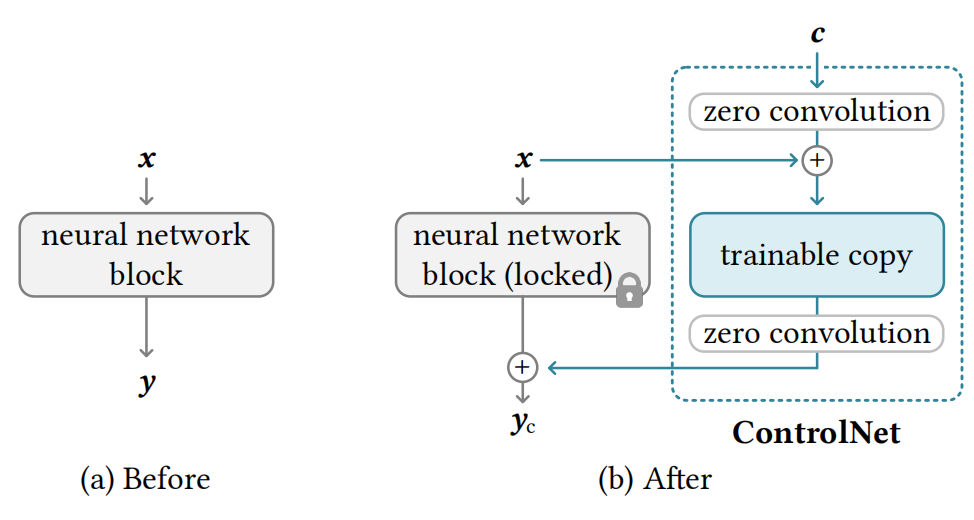
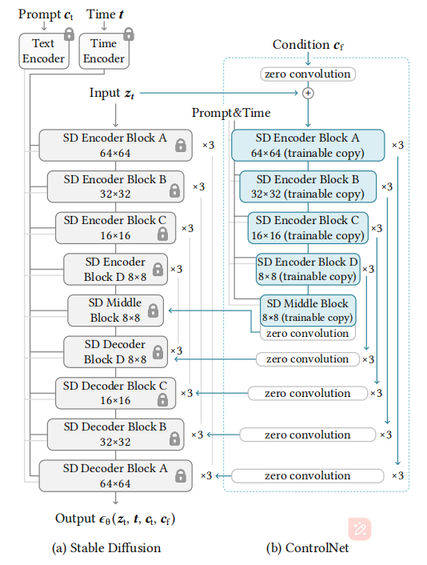

2302.05543v3

# 摘要

我们提出了ControlNet，一个神经网络架构，以添加空间条件反射控制到大型的，预先训练的文本到图像扩散模型。控制网锁定了可生产的大型扩散模型，并重用它们的深度和健壮的编码层，作为一个强大的主干来学习一组不同的条件控制。神经结构与“zero convolutions”（zero-initialized convolution layers）相连，它使参数从零逐步增长，并确保没有有害的噪声会影响微调。我们测试各种条件反射控制，例如，边缘，深度，分割，人体姿态等，与稳定扩散，使用单一或多个条件，有或没有提示。我们证明，在小（<50k）和大（>1m）数据集上，控制网络的训练是鲁棒性的。广泛的结果表明，控制网可以更广泛地应用于控制图像扩散模型。

## 导言

## 方法

控制网络是一种神经网络体系结构，它可以增强具有空间定位、特定任务的图像条件的大型预训练的文本到图像扩散模型。我们首先在第3.1节中介绍了控制网的基本结构，然后在第3.2节中描述了我们如何将控制网应用于图像扩散模型的稳定扩散[72]。我们在第3.3节中详细阐述了我们的训练，并详细介绍了推理过程中的一些额外的考虑，比如在第3.4节中组合多个控制网。

#### ControlNet

ContolNet向神经网络块注入额外的条件（图2）。在此，我们使用术语网络块来指一组神经层，这些神经层通常组合在一起形成一个神经网络单元，如resnet block, conv-bn-relu block, multi-head attention block, transformer block等。假设$F(·;Θ)$是这样一个训练过的神经块，参数为Θ，它将输入特征映射x转换为另一个特征映射y为

在我们的设置中，x和y通常是二维特征图，即$x∈R^{h×w×c}，{h、w、c}$分别为图中的高度、宽度和通道数。

为了向这样一个预先训练过的神经块添加一个控制网，我们锁定（冻结）原始块的参数Θ，并同时将该块克隆到一个具有参数$Θ_c$的可训练副本中。可训练的副本以一个外部条件向量c作为输入。当这种结构应用于像稳定扩散这样的大型模型时，锁定参数保留了用数十亿张图像训练的生产准备模型，而可训练副本重用这种大规模的预训练模型来建立一个深度、健壮和强大的主干，以处理不同的输入条件。

可训练的副本连接到具有零卷积层的锁定模型，表示为$Z(·;·)$。具体来说，$Z(·;·)$是一个1×1的卷积层，其权值和偏差都被初始化为零。为了建立一个控制网，我们分别使用了两个具有参数$Θz_1$和$Θ{z_2}$的零卷积实例。然后用完整的控制网进行计算：

其中，$y_c$是ControlNet block的输出。在第一步训练中，由于零卷积层的权值和偏差参数都被初始化为零，因此式(2)中的$Z(·;·)$项都计算为零，并且

这样，当训练开始时，有害噪声就不能影响trainable copy（可训练副本）中神经网络层的隐藏状态。此外，由于$Z(c;Θz_1)= 0$和可训练副本也接收输入图像x，可训练副本是完全功能的，并保留了大型的预训练模型的能力，允许其作为进一步学习的强大骨干。零卷积通过消除在初始训练步骤中作为梯度的随机噪声来保护这个主干。我们详细介绍了补充材料中零卷积的梯度计算。

(a)一个神经块以一个特征映射x作为输入，并输出另一个特征映射y

(b)为了向这样的块添加一个ControlNet，我们锁定原始块并创建一个trainable copy（可训练的副本），并使用零卷积层将它们连接在一起，即，1×1卷积，权重和偏差都初始化为零。这里c是我们希望添加到网络中的条件向量。

### ControlNet for Text-to-Image Diffusion

我们使用稳定扩散[72]为例来展示控制网如何将条件控制添加到一个大型的预训练扩散模型中。稳定扩散本质上是一个带有一个encoder, a middle block, and a skip-connected decoder（编码器、一个中间块和一个跳过连接解码器）的U-Net [73]。编码器和解码器都包含12个块，完整的模型包含25个块，包括中间块。在25个块中，8个块是下采样或上采样卷积层，而其他17个块是主块，每个块包含4个重网层和2个视觉变压器（ViTs）。每个ViT都包含了几种crossattention and self-attention机制。例如，在图3a中，“SD Encoder Block A”包含4个resnet层和2个vit，而“×3”表示该块重复了三次。文本提示使用CLIP文本编码器[66]，和diffusion时间步长编码是用一个使用positional encoding（位置编码）的时间编码器。

ControlNet结构应用于U-net的每个编码器级别（图3b）。特别是，我们使用ControlNet创建了12个编码块和1个稳定扩散中间块的可训练副本。12个编码块有4个分辨率（64×64,32×32,16×16,8×8），每个编码块重复3次。输出被添加到U型网的12个跳过连接和1个中间块中。由于稳定扩散是一个典型的u型网结构，这种控制网体系结构很可能适用于其他模型。

我们连接控制网的方式是计算效率很高的——由于锁定的拷贝参数被冻结了，因此在最初锁定的编码器中不需要进行梯度计算来进行微调。这种方法加快了训练速度，节省了GPU内存。在单个NVIDIA A100 PCIE 40GB上测试，与没有控制网的优化稳定扩散相比，使用控制网优化稳定扩散在每次训练迭代中只需要大约23%的GPU内存和34%的时间。

图像扩散模型学习逐步去噪图像，并从训练域生成样本。去噪过程可以发生在像素空间或从训练数据编码的潜在空间中。稳定扩散使用潜图像作为训练域，在这个空间中工作已经被证明可以稳定训练过程[72]。具体来说，稳定扩散使用一种类似于VQ-GAN [19]的预处理方法，将512×512像素空间图像转换为更小的64×64潜在图像。为了将控制网添加到稳定扩散中，我们首先转换每个输入的条件反射图像（例如，边缘、姿态、深度等）。从一个输入大小为512×512到一个64×64的特征空间向量，匹配稳定扩散的大小。特别是，我们使用一个小网络$E(·)
$四个卷积层4×4内核和2×2步（重新激活了，使用16、32、64、128，通道分别初始化与高斯权重和训练与完整的模型）编码一个图像空间条件$c_i$特征空间条件向量$c_f$，条件反射向量$c_f$被传递到控制网中

