2105.05233v4：CLASSIFIER GUIDANCE

[https://github.com/openai/guided-diffusion](https://github.com/openai/guided-diffusion)

2207.12598v1：CLASSIFIER-FREE GUIDANCE

# 摘要

Classifier guidance（分类器引导）是最近引入的一种方法，在训练后的条件扩散模型中权衡模式覆盖和样本保真度，与其他类型的生成模型中的低温采样或截断精神相同。分类器指导将扩散模型的分数估计与图像分类器的梯度相结合，因此需要训练与扩散模型分离的图像分类器。它还提出了这样一个问题，即是否可以在没有分类器的情况下进行指导。我们表明，指导确实可以由一个纯生成模型没有这样的分类器：在我们所谓的无分类器指导，我们共同训练一个条件和无条件的扩散模型，我们结合产生的条件和无条件的分数估计达到权衡样本质量和多样性类似于使用分类器指导。

## 导言

## GUIDANCE

某些生成模型的一个有趣的特性，如GANs和基于流的模型，是能够通过在采样时减少生成模型的噪声输入的方差或范围来执行截断或低温采样。其预期的效果是减少样品的多样性，同时提高每个单独样品的质量。例如，BigGAN中的截断（Brock et al.，2019），分别产生了低截断量和高截断量的FID评分和初始评分之间的权衡曲线。Glow的低温采样（Kingma & Dhariwal，2018）也有类似的效果。

不幸的是，在扩散模型中直接实现截断或低温采样的尝试是无效的。例如，在反向过程中，缩放模型得分或降低高斯噪声的方差会导致扩散模型产生模糊的、低质量的样本（Dhariwal & Nichol，2021）。

### CLASSIFIER GUIDANCE

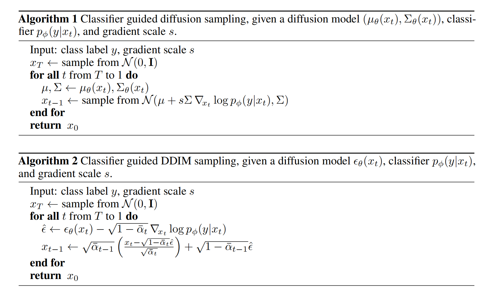

算法1（DDPM）：

为了加入条件，将$p_θ(x_t|x_{t+1})$，修改为下式，y为分类器结果：

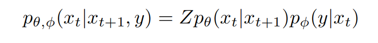

$p_θ(x_t|x_{t+1})$服从高斯分布，log展开为（4）

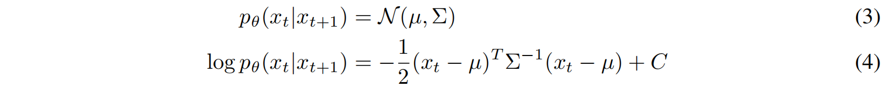

$g=∇_{x_t}logp_φ(y|x_t)|_{x_t=µ}$和 C是常数，$C+g = C_1$，化简后（6）

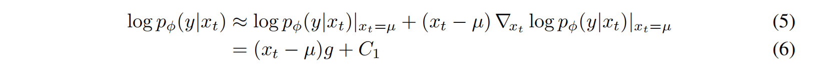

log展开（7），式（9）中 $x_t$, $\mu$ （是通过预测噪音得知）都是已知，$g$ 是分类器梯度。

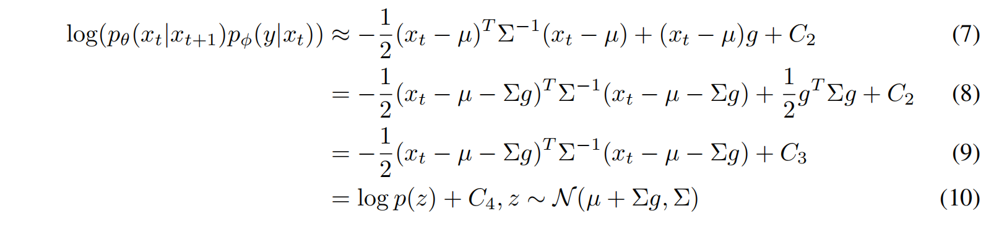

算法2（DDIM）：

对$x_t$求梯度：

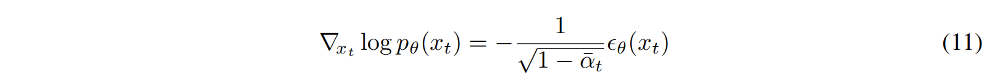

变换后为（13）

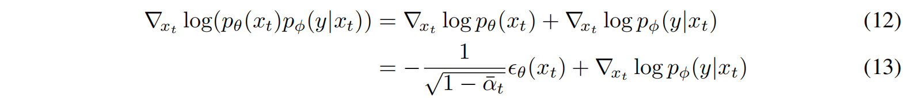

通过SDE（随机微分方程）变换为：

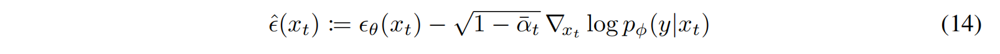

### CLASSIFIER-FREE GUIDANCE

虽然分类器指导成功地从截断或低温采样中权衡了IS和FID，但它仍然依赖于来自图像分类器的梯度，由于第1节中所述的原因，我们寻求消除该分类器。在这里，我们描述了无分类器的引导，它在没有这种梯度的情况下达到了同样的效果。无分类器引导是一种修改$\\theta(z_\lambda, c)$的替代方法，使其具有与分类器引导相同的效果，但没有分类器。算法1和算法2详细描述了在无分类器指导下的训练和采样。

我们不是训练一个单独的分类器模型，而是选择训练一个通过分数估计器$\\theta(z_\lambda)$参数化的无条件去噪扩散模型$p_θ(z)$，以及通过$\\theta(z_\lambda, c)$参数化的条件模型$p_θ(z|c)$。我们使用一个单一的神经网络来参数化这两个模型，对于无条件模型，在预测分数时，我们可以简单地为类标识符c输入一个空标记∅，即$\\theta(z_\lambda) = \\theta(z_\lambda,c=\phi)$。我们共同训练无条件的和条件模型简单地将c随机设置为无条件类标识符∅，具有一定的概率约束$p_{uncond}$，设置为超参数（当然可以训练单独的模型，而不是联合训练它们，但我们选择联合训练是因为它实现起来非常简单，不会使训练管道复杂化，也不会增加参数的总数）。然后，我们使用以下条件和无条件分数估计的线性组合进行抽样：

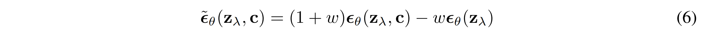

(6)没有分类器梯度存在，所以在$\widetilde{\epsilon}_\theta$方向上迈出一步不能被解释为对图像分类器的基于梯度的对抗性攻击。此外，由于使用无约束神经网络，$\widetilde{\epsilon}_\theta$是由非保守向量场的分数估计构造的，因此一般不存在标量势，如分类器对数似然，其中$\widetilde{\epsilon}_\theta$是分类器引导的分数。

尽管通常可能不存在一个分类器，而等式(6)是分类引导的分数，它实际上是受到隐式分类器$p^i(c|z_λ)∝p(z_λ|c)/p(z_λ)$的梯度的启发。如果我们能得到准确的分数$ \epsilon^\star (z_λ, c)$和$ \epsilon^\star (z_λ)$（$p(z_λ|c)$ and $p(z_λ)$）, 那么这个隐式分类器的梯度将是$∇z_λ log p^i (c|z_λ) = −\frac{1}{σ_λ} [\epsilon^ ∗ (z_λ, c) − \epsilon ^∗ (z_λ)]$, 而分类器指导与该隐式分类器，将把分数估计修改为$ \widetilde{\epsilon}^∗ (z_λ, c) = (1 + w)\epsilon^∗ (z_λ, c) − w\epsilon^ ∗ (z_λ)$请注意它与等式的相似之处(6)，但也要注意到$\widetilde{\epsilon}^∗(z_λ，c)与\widetilde{\epsilon}(z_λ，c)$有根本上的不同。前者是由比例分类器梯度$\epsilon^ ∗ (z_λ, c) − \epsilon ^∗ (z_λ)$构造的；后者是由估计$\epsilon (z_λ, c) − \epsilon (z_λ)$构造的，这个表达式通常不是任何分类器的（比例）梯度，同样因为分数估计是无约束神经网络的输出。

使用贝叶斯规则反演生成模型可以产生一个很好的提供有用的引导信号的分类器，这是先验的并不明显。例如，Grandvavert&Bengio（2004）发现，鉴别模型通常优于来自生成模型的隐式分类器，即使是在这些生成模型的规范与数据分布完全匹配的人工情况下。在我们这样的情况下，我们期望模型被错误指定，贝叶斯规则推导的分类器可能不一致（Grunwald & Langford，2007），我们失去了对它们性能的所有保证。¨然而，在第4节中，我们的经验表明，无分类器指导能够以与分类器指导相同的方式权衡FID和IS。在第5节中，我们将讨论无分类器指导与分类器指导相关的含义。

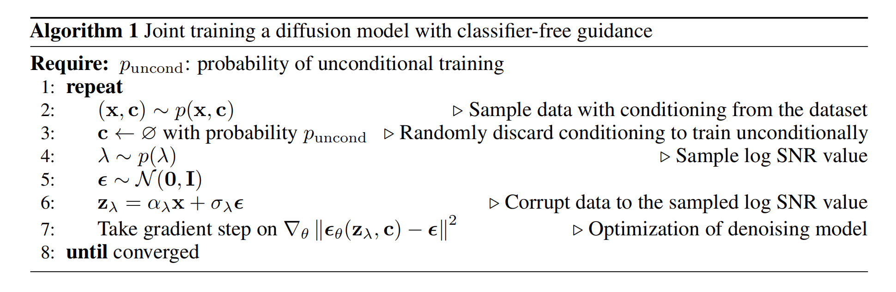

**sampling**

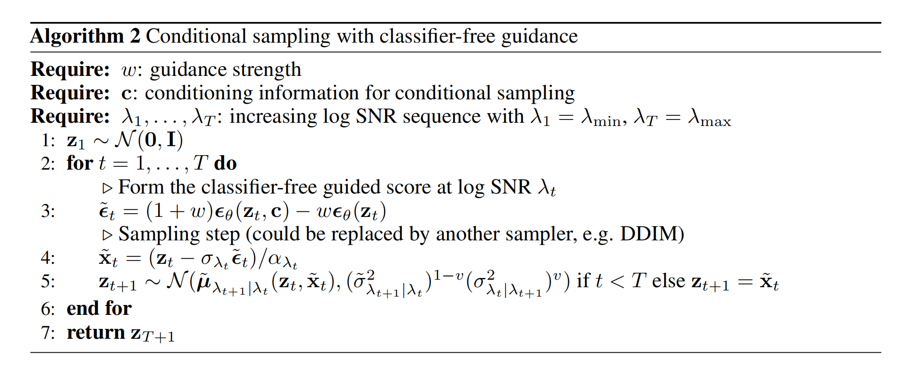

