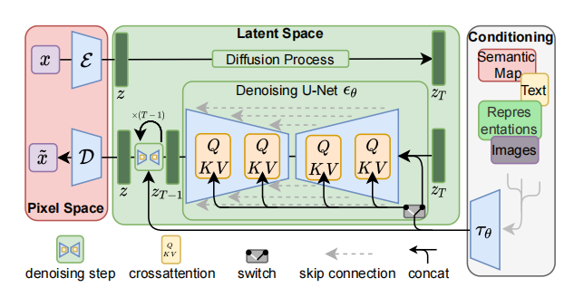

2112.10752v2

[https://github.com/CompVis/latent-diffusion](https://github.com/CompVis/latent-diffusion)

# 摘要

通过将图像形成过程分解为去噪自编码器的连续应用，扩散模型（DMs）实现了对图像数据等方面的最先进的综合结果。此外，他们的公式允许一个指导机制来控制图像生成过程，而无需再训练。然而，由于这些模型通常直接在像素空间中运行，强大的DMs的优化通常需要数百天的GPU，而且由于顺序评估，推理是昂贵的。为了能够在有限的计算资源上进行DM训练，同时保持其质量和灵活性，我们将其应用于强大的预训练自动编码器的潜在空间中。**与之前的工作相比，在这种表示上训练扩散模型首次允许在降低复杂度和保持细节复杂度之间达到一个接近最优的点，大大提高了视觉保真度。**通过在模型架构中引入交叉注意层，我们将扩散模型转化为强大而灵活的生成器，用于一般的条件反射输入，如文本或边界框，以卷积方式和高分辨率的合成成为可能。我们的潜在扩散模型（LDMs）在图像内绘制和类条件图像合成方面获得了新的最先进的分数，并且在各种任务上具有高度竞争力的性能，包括文本到图像合成、无条件图像生成和超分辨率，同时与基于像素的DMs相比，显著降低了计算需求。

## 导言

图像合成是最近发展最迅速的计算机视觉领域之一，也是计算需求最大的计算机视觉领域之一。特别是复杂、自然场景的高分辨率合成，目前主要是扩大基于可能性的模型，可能包含自回归（AR）变压器中的数十亿个参数。相比之下，GANs 的有希望的结果已经被揭示为大多局限于相对有限的可变性的数据，因为它们的对抗性学习过程不容易扩展到建模复杂的、多模态分布。最近，扩散模型[82]，基于自动编码器去噪层次，已经显示了令人印象深刻的成就，并定义了最先进的类条件图像合成[15,31]和超分辨率[72]。此外，与其他类型的生成模型[19,46,69]相比，即使是无条件的DMs也可以很容易地应用于诸如内涂漆和着色[85]或基于中风的合成[53]等任务。作为基于似然的模型，它们不表现出作为GANs的模式崩溃和训练不稳定性，通过大量利用参数共享，它们可以建模高度复杂的自然图像分布，而不涉及像AR模型中那样的数十亿个参数。

总之，我们的工作做出了以下贡献：

- 与纯粹基于变压器的方法[23,66]相比，我们的方法更适合高维数据，因此(a)可以在压缩级别上工作，提供比以前的工作更如实和详细的重建（见图1），(b)应用于百万像素图像的高分辨率合成。

- 我们在多个任务（无条件图像合成、内绘制、随机超分辨率）和数据集上实现了具有竞争力的性能，同时显著降低了计算成本。与基于像素的扩散方法相比，我们也显著降低了推理成本。

- 我们表明，与之前的工作[93]相比，它同时学习编码器/解码器架构和基于分数的先验，我们的方法不需要重建和生成能力的精细加权。这确保了非常忠实的重建，并且只需要很少的潜在空间的正规化

- 我们发现，对于超分辨率、内画和语义合成等密集条件任务，我们的模型可以以卷积方式应用，并渲染∼10242 px的大的一致图像。

- 此外，我们还设计了一种基于交叉注意的通用条件反射机制，从而实现了多模态训练。我们使用它来训练类条件的模型、文本到图像的模型和布局到图像的模型。

## 方法

降低训练的计算需求的扩散模型对高分辨率图像合成，我们观察到，尽管扩散模型允许忽略感知不相关的细节不足采样相应的损失项，他们仍然需要昂贵的函数评估像素空间，导致巨大的需求计算时间和能源资源。

我们建议通过引入压缩学习阶段和生成学习阶段的显式分离来规避这一缺点（见图2）。为了实现这一点，我们使用了一个自动编码模型，它学习了一个在感知上与图像空间等价的空间，但显著降低了计算复杂度。

这种方法有几个优点： 

- 通过离开高维图像空间，我们得到了Diffusion model在计算上更高效，因为采样是在低维空间上进行的。

- 我们利用了从其UNet架构[71]中继承来的dm的归纳偏差，这使得它们对具有空间结构的数据特别有效，因此减轻了以前方法[23,66]所要求的积极的、降低质量的压缩级别的需求。

- 最后，我们得到了通用压缩模型，其潜在空间可用于训练多个生成模型，也可以用于其他下游应用，如单图像CLIP-guided合成。

### Perceptual Image Compression

我们的感知压缩模型是基于之前的工作[23]，由一个结合感知损失[106]和一个基于补丁的[33]对抗目标[20,23,103]训练的自动编码器组成。这确保了通过加强局部实在性，重建被限制在图像流形中，并避免了仅依赖像素空间损失，如L2或L1目标而引入的模糊。

更准确地说，给定一个图像$x∈R^{H×W×3}$ 在RGB空间，编码器E编码成一个潜在的代表$z=\xi(x)$，和解码器D重建潜在的图像，给$x=D(z)=D(\xi(x))$，$z∈R^{h\times w \times c}$。重要的是，编码器对图像的降采样因子$f = H/h = W/w$，我们研究了不同的降采样因子$f = 2^m，m∈N$。

为了避免任意高方差的潜在空间，我们实验了两种不同的正则化。第一个变体，KL-reg。对学习的潜在施加标准的kl惩罚，类似于VAE [46,69]，而VQ-reg。在解码器内使用矢量量化层[96]。该模型可以解释为一个VQGAN [23]，但量化层被解码器吸收。因为我们随后的DM被设计用于我们学习的潜在空间z = E (x)的二维结构，我们可以使用相对温和的压缩率，并实现非常好的重建。这与之前的工作[23,66]形成了对比，[23,66]依赖于学习空间z的任意一维排序来自动回归建模其分布，因此忽略了z的大部分固有结构。因此，我们的压缩模型更好地保留了x的细节(参见选项卡。 8).完整的目标和培训细节可以在补充部分中找到。

### Latent Diffusion Models

