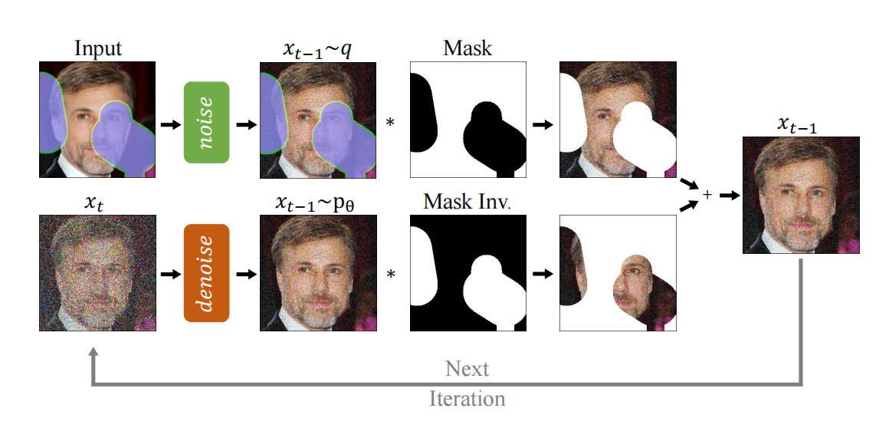

2201.09865v4

[https://github.com/andreas128/RePaint](https://github.com/andreas128/RePaint) 

# 摘要

自由形式的图像修复是在任意二进制掩码指定的区域内向图像添加新内容的任务。大多数现有的方法训练一定的掩码分布，这将其泛化能力限制为不可见的掩码类型。此外，使用像素级和感知损失的训练通常会导致对缺失区域的简单纹理扩展，而不是语义上有意义的生成。在这项工作中，我们提出了一种基于RePaint：去噪扩散概率模型（DDPM）的重绘制方法，甚至适用于极端掩码。我们使用一个预先训练的无条件DDPM作为生成先验。为了调整生成过程，我们只通过使用给定的图像信息对未掩蔽区域进行采样来改变反向扩散迭代。由于这种技术不修改或调整原始的DDPM网络本身，该模型为任何内部绘制形式产生高质量和多样化的输出图像。我们验证了我们的方法，为人脸和通用图像内绘制使用标准和极端面具。RePaint的性能优于最先进的自回归和GAN方法。

## 导言

我们提出RePaint：一种图像修复方法仅仅利用现成的无条件的训练的DDPM。具体来说，我们不是学习掩模条件生成模型，而是在反向扩散迭代中从给定像素采样来条件生成过程。值得注意的是，我们的模型因此并没有针对图像修复任务本身进行训练。这有两个重要的优点。首先，它允许我们的网络在推理过程中推广到任何掩码。其次，它使我们的网络能够学习更多的语义生成能力，因为它有一个强大的DDPM图像合成先验。

虽然标准的DDPM采样策略产生匹配的纹理，但插入在语义上通常是不正确的。因此，我们引入了一种改进的去噪策略，即重新采样（RePaint）迭代以更好地处理图像。值得注意的是，我们的方法没有减缓扩散过程[7]，而是在扩散时间上向前和后退，产生了显著的语义意义的图像。我们的方法允许网络在整个推理过程中有效地协调生成的图像信息，从而对给定的图像信息进行更有效的调节。

## 相关工作

早期的图像输入绘画或图像完成的尝试利用了输入图像中的低级线索或者在一个大型图像数据集的邻居内来填补缺失的区域。

确定性的图像填充：

多样化的图像填充：

使用图像先验：

图像条件扩散模型：

我们提出了一种无条件训练模型的条件方法，并行工作[29]基于无分类器引导[13]来训练图像扩散模型。图像处理的另一个方向是使用扩散模型的图像到图像的转换，正如在并发工作中所探索的那样

## Method

### Conditioning on the known Region

插入绘制的目标是使用掩模区域作为条件来预测图像的缺失像素。在本文的其余部分中，我们考虑了一个训练好的无条件去噪扩散概率模型(2)。我们将地面真实图像表示为x，未知像素表示为$m⊙x$，已知像素表示为$(1−m)⊙x$。

因为从$x_t$到$x_{t−1}$的每个反向步骤(2)都完全依赖于$x_t$，我们可以改变已知的区域$(1 − m) ⊙ x_t$只要我们保持相应分布的正确属性。由于前向过程是由添加了高斯噪声的马尔可夫链(1)定义的，因此我们可以使用(7)在任意时间点对中间图像$x_t$进行采样。这允许我们在任何时间步t对已知区域$m⊙x_t$进行采样。因此，使用(2)对于未知区域和(7)对于已知区域，我们在我们的方法中实现了一个反向步骤的以下表达式，

因此，$x^{known}_{t−1}$使用给定图像$m⊙x_0$中的已知像素进行采样，而$x_{t-1}^{unknow}$从模型中进行采样，给定之前的迭代$x_t$。然后使用掩码将这些数据组合到新的示例$x_{t−1}$中。我们的方法如图2所示。

图2.我们的方法的概述。重绘制修改标准去噪过程，以条件给定的图像内容。在每一步中，我们从输入中采样已知的区域（顶部），从DDPM输出中采样已绘制的部分（底部）。

### Resampling

当直接应用第4.1节中描述的方法时，我们观察到只有内容类型与已知区域匹配。例如，在图3 n = 1中，被绘制的区域是一个与狗的毛发相匹配的毛茸茸的纹理。虽然绘制区域与相邻区域的纹理匹配，但在语义上是不正确的。因此，DDPM是充分利用了已知区域的上下文，但它并没有很好地与图像的其余部分协调起来。接下来，我们将讨论造成这种行为的可能原因。

从图2中，我们分析了该方法是如何调节已知区域的。如(8)所示，该模型使用$x_t$预测$x_{t−1}$，$x_t$包括DDPM (2)的输出和来自已知区域的样本。但是，使用(7)对已知像素进行采样时，没有考虑图像中生成的部分，这就引入了不和谐。尽管模型试图在每一步中再次协调图像，但它永远不能完全收敛，因为在下一步中也会出现同样的问题。此外，在每一个反向步骤中，由于$β_t$的方差计划，对图像的最大变化下降。因此，由于灵活性受限，该方法无法纠正在后续步骤中导致不和谐边界的错误。因此，在进入下一个去噪步骤之前，模型需要更多的时间将已知的条件信息$x^{known}_{t−1}$与生成的信息$x^{unknown}_{t−1}$一步协调起来。

由于DDPM被训练成生成位于数据分布内的图像，因此它的目标自然是生成一致的结构。在我们的重采样方法中，我们使用这个DDPM属性来协调模型的输入。因此，我们通过从(1)采样为$x_t∼N(\sqrt{1−β_tx_{t−1}}，β_tI)$，将输出的$x_t−1$扩散回$x_t$。尽管这个操作缩减输出并添加噪声，生成区域$x^{unknown}_{t−1}$中包含的一些信息仍然保留在$x^{unknown}_{t}$。它导致了一个新的$x^{unknown}_{t}$，它与$x^{known}_{t}$更协调，并且包含来自它的条件信息。

由于这个操作只能协调一个步骤，因此它可能无法在整个去噪过程中合并语义信息。为了克服这个问题，我们将该操作的时间范围表示为跳跃长度，对于前一种情况为$j = 1$。类似于扩散速度[7] (a.k.a.减速)，重新采样也增加了反向扩散的运行时间。通过减少每个去噪步骤中增加的方差，减速可以应用更小但更多的重采样步骤。然而，这是一种完全不同的方法，因为减缓扩散仍然有不协调图像的问题，正如我们在重采样策略中所描述的那样。我们通过经验证明了我们的方法的这一优势。

