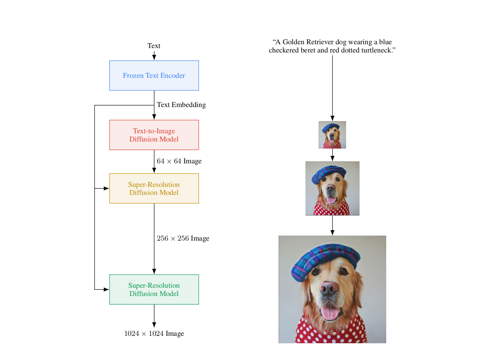

2205.11487v1

# 摘要

我们提出了图像，一个文本到图像的扩散模型，具有前所未有的摄影现实主义程度和深刻的语言理解水平。Imagen建立在大型变压器语言模型在理解文本方面的能力之上，并依赖于扩散模型在高保真图像生成中的强度。我们的关键发现是通用大型语言模型（例如T5），预先训练的文本语料库，惊人的有效文本编码图像合成：增加语言模型的大小提高样本保真度和图像文本对齐远远超过增加图像扩散模型的大小。Imagen在COCO数据集上获得了最先进的7.27分，从未对COCO进行过训练，人类评分者发现Imagen样本在图像-文本对齐方面与COCO数据本身不相等。为了更深入地评估文本到图像模型，我们引入了DrawBench，一个全面且具有文本到图像模型挑战性的基准。使用DrawBench，我们将Imagen与最近的方法包括VQ-GAN+CLIP、潜在扩散模型、GLIDE和DALL-E 2，发现在并排比较中，在样本质量和图像-文本对齐方面，人类评分者更喜欢Imagen模型

## 导言

多模态学习最近开始很突出，文本到图像合成[53,12,57]和图像-文本对比学习[49,31,74]在前沿。这些模型改变了研究界，并通过创造性的图像生成[22,54]和编辑应用程序[21,41,34]引起了公众的广泛关注。为了进一步追求这一研究方向，我们引入了Imagen，这是一种文本到图像的扩散模型，它结合了transformer语言模型（LMs）[15,52]的力量和高保真扩散模型[28,29,16,41]，在文本到图像的合成中提供了前所未有的摄影现实感程度和深刻的语言理解。与之前只使用图像-文本数据进行模型训练的工作相比[例如，53,41]，Imagen背后的关键发现是，来自大型LMs [52,15]的文本嵌入，在仅使用文本的语料库上进行预训练，对文本到图像的合成非常有效。所选择的样本见图1。

Imagen包括一个冻结的T5-XXL [52]编码器，将输入文本映射到一个嵌入序列和一个64×64图像扩散模型，然后是两个超分辨率扩散模型来生成256×256和1024×1024图像(见图。A.4).所有的扩散模型都以文本嵌入序列为条件，并使用无分类器的引导[27]。Imagen依赖于新的采样技术，允许使用大的引导权重，而不会在之前的工作中观察到样本质量下降，从而产生比以前更高的保真度和更好的图像-文本对齐。

虽然概念上的简单和易于训练，但Imagen产生了惊人的强大的结果。Imagen在COCO [36]上优于其他方法，zero-shot FID-30K为7.27，显著优于之前的工作，如GLIDE[41]（12.4）和DALL-E 2 [54]的并行工作（10.4）。我们的zero-shot FID得分也比用COCO训练的最先进的模型更好，例如，Make-A-Scene[22]（在7.6）。此外，人类评分者指出，从Imagen生成的样本在图像-文本与COCO字幕上的参考图像对齐方面是相同的。

我们介绍了DrawBench，一种新的结构化文本提示套件，用于从文本到图像的评估。DrawBench通过对文本到图像模型的多维评估来实现更深入的见解，并设计了文本提示来探索模型的不同语义属性。这些包括组合性、基数、空间关系、处理复杂文本提示或罕见单词的提示的能力，它们包括创造性提示，推动模型生成高度不可信的场景的能力极限，远远超出了训练数据的范围。通过DrawBench，广泛的人体评估表明，Imagen的性能显著优于其他最近的方法[57,12,54]。我们进一步演示了使用大型预训练语言模型[52]相对于多模态嵌入的一些明显优势，如CLIP [49]作为Imagen的文本编码器。

该论文的主要贡献包括：

1. 我们发现，仅在文本数据上训练的大型冻结语言模型对于文本到图像的生成是非常非常有效的文本编码器，并且缩放冻结文本编码器的大小比缩放图像扩散模型的大小更能显著提高样本质量。

2. 我们引入了动态阈值法，一种新的扩散采样技术，利用高制导权重，生成比以前更真实和详细的图像。

3. 我们强调了几个重要的扩散架构设计选择，并提出了高效的U-Net，这是一种新的架构变体，它更简单、收敛速度更快、内存效率更高。

4. 我们实现了最先进的COCO FID为7.27。人类评分者发现，在图像-文本对齐方面，图像图像与参考图像相当。

5. 我们介绍了DrawBench，一个新的全面和具有挑战性的文本到图像任务的评估基准。在DrawBench的人类评估中，我们发现Imagen优于所有其他工作，包括DALL-E 2的并发工作。

## Imagen

Imagen由一个将文本映射到嵌入序列的文本编码器和一个将图像映射到embeddings提高图像分辨率的的级联条件扩散模型组成。在下面的子部分中，我们将详细描述其中的每个组件。

### Pretrained text encoders

文本到图像的模型需要强大的语义文本编码器来捕获任意自然语言文本输入的复杂性和组合性。根据成对图像-文本数据训练的文本编码器在当前文本到图像模型中是标准的；它们可以从头开始[41,53]进行训练，也可以在图像-文本数据[54]上进行预训练（例如，CLIP [49]）。图像-文本训练目标表明，这些文本编码器可以编码视觉上的语义和有意义的表示，特别是与文本到图像的生成任务相关。大型语言模型可以是对文本进行编码以便文本到图像生成的另一种模型。最近在大型语言模型（如BERT [15]，GPT [47,48,7]，T5 [52]）方面的进展已经导致了文本理解和生成能力的飞跃。语言模型仅在文本语料库上进行训练，其明显大于成对的图像-文本数据，因此暴露于非常丰富和广泛的文本分布中。在当前的图像-文本模型[49,31,80]中，这些模型通常也比文本编码器大得多（例如，PaLM [11]有540B参数，而CoCa [80]有一个≈1B参数文本编码器）。

### Diffusion models and classifier-free guidance

### Large guidance weight samplers

### Robust cascaded diffusion models

### Neural network architecture

Imagen的可视化。Imagen使用冻结的文本编码器将输入的文本编码到文本嵌入中。条件扩散模型将文本嵌入到64×64图像中。Imagen进一步利用文本条件的超分辨率扩散模型对图像进行上采样，首先是64×64→256×256，然后是256×256→1024×1024。

