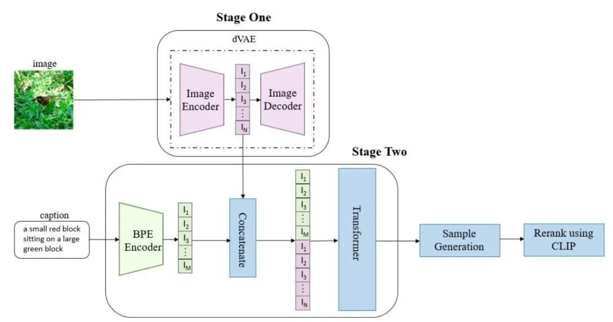

2102.12092v2

[https://github.com/openai/DALL-E](https://github.com/openai/DALL-E)

# 摘要

文本到图像的生成传统上专注于在一个固定的数据集上为训练找到更好的建模假设。这些假设可能涉及复杂的架构、辅助损失或侧信息，如在训练期间提供的对象部分标签或分割掩模。我们描述了一个基于转换器的简单方法，该转换器自动回归地将文本和图像标记建模为单个数据流。有了足够的数据和规模，当以零镜头方式评估时，我们的方法与以前的领域特定模型具有竞争力。

## 导言

## Method

我们的目标是训练一个transformer，将文本和图像标记自动回归地建模为单个数据流。然而，直接使用像素作为图像代币，对于高分辨率的图像将需要过多的内存。可能性目标倾向于优先建模像素之间的短期依赖关系，因此大部分建模能力将用于捕获高频细节，而不是使我们在视觉上识别物体的低频结构。

我们通过使用一个两阶段的训练程序来解决这些问题，类似于vq-vae，vq-vae2：

**Stage 1**。我们训练一个离散变分自编码器（dVAE），将每一个256×256RGB图像压缩成一个32×32的图像标记网格，每个元素可以假设8192个可能的值。这将transformer的上下文大小减少了192倍，而视觉质量没有大幅下降。

**Stage 2**。我们将多达256个BPE编码的文本标记与32个×32 = 1024图像标记连接起来，并训练一个自回归转换器来建模文本和图像标记上的联合分布。

### Stage One: Learning the Visual Codebook

在训练的第一阶段，我们使φ和θ的ELB最大化，这对应于单独在图像上训练一个dVAE。我们将初始先验$p_ψ$设置为K = 8192码本向量上的均匀分类分布，并将qφ设置为编码器在32×32网格输出中相同空间位置的8192日志参数化的分类分布。

附录A.2给出了对超参数的完整描述，但我们发现以下内容对稳定训练特别重要：

- 针对弛豫温度和步长的特定退火计划。我们发现，将τ退火到1/16足以缩小松弛验证ELB和qφ τ的真实验证ELB之间的差距。

- 在编码器的末端和解码器的开始使用1×1卷积。我们发现，减少在松弛周围的卷积的接受场的大小，导致它更好地推广到真正的ELB。

- 将来自编码器和解码器的输出激活再乘以一个小的常数，以确保初始化时的稳定训练。

