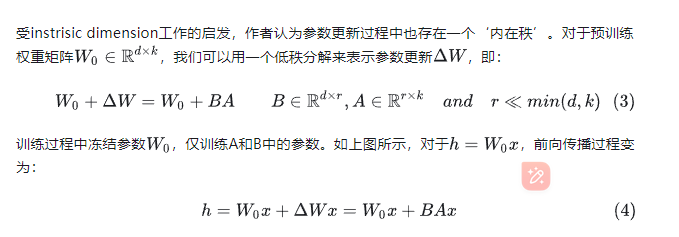
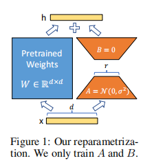
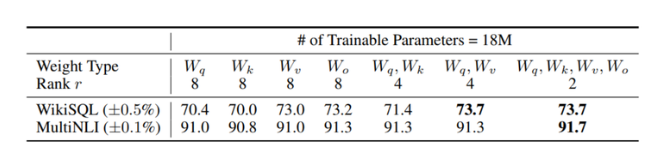
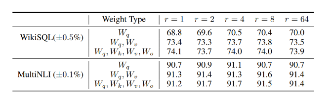
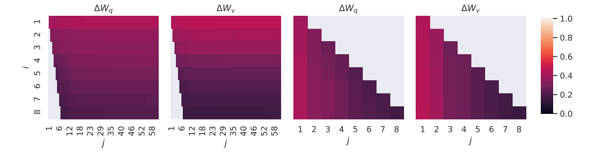
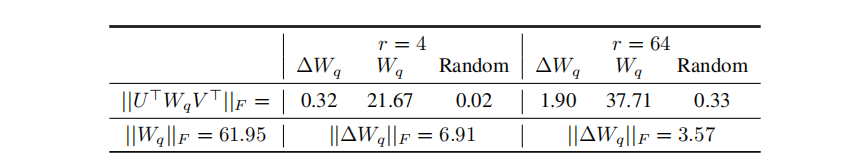

2106.09685v2

[https://github.com/microsoft/LoRA.](https://github.com/microsoft/LoRA.)

# 摘要

自然语言处理的一个重要范例包括对一般领域数据进行大规模的预训练和对特定任务或领域的适应。当我们对更大的模型进行预训练时，重新训练所有模型参数的完全微调就变得不那么可行了。以GPT-3 175B为例——部署微调模型的独立实例，每个模型都有175B参数，这是非常昂贵的。我们提出了Low-Rank Adaptation，或称LoRA，它冻结了预先训练的模型权值，并将可训练的秩分解矩阵注入变压器架构的每一层，大大减少了下游任务的可训练参数的数量。与使用Adam进行微调的GPT-3 175B相比，LoRA可以减少可训练参数的数量10000倍。

## 导言

Adma微调的主要缺点是，新模型包含的参数与原始模型一样多。[Aghajanyan](https://arxiv.org/abs/2012.13255)的研究表明：**预训练模型拥有极小的内在维度(instrisic dimension)，即在降维或者压缩数据过程中，为了让你的数据特征最大程度的保持，你最低限度需要保留哪些features**。**同时Aghajanyan发现在预训练后，越大的模型有越小的内在维度，这也解释了为何大模型都拥有很好的few-shot能力。**我们假设模型适应过程中权重的变化也具有较低的“内在秩”，这导致了我们提出的低秩适应（LoRA）方法。LoRA允许我们通过优化适应过程中密集层变化的秩分解矩阵来间接训练神经网络中的一些密集层，同时保持预先训练的权值冻结，只训练A和B。

LoRA有几个关键的优势：

- 一个预先训练过的模型可以被共享，并用于为不同的任务构建许多小型的LoRA模块。我们可以冻结共享模型，并且通过替换图1中的矩阵A和矩阵B来有效地切换任务，从而显著地减少了存储需求和任务切换开销。

- 当使用自适应优化器时，LoRA使训练效率提高，并将硬件进入门槛降低了3倍，因为我们不需要计算梯度或维护大多数参数的优化器状态。相反，我们只优化注入的，更小的低秩矩阵。

- 我们简单的线性设计允许我们在部署时将可训练矩阵与冻结权值合并，通过构造，与完全微调的模型相比，不引入推理延迟。

- LoRA与许多先前的方法正交，可以与其中许多方法结合，比如prefifix-tuning（前缀调优）。

使用**LORA**，训练参数仅为整体参数的万分之一、GPU显存使用量减少2/3且不会引入额外的推理耗时

## **LORA为何有效？**

通过大量的对比实验，作者证明了LORA的有效性，但是作者希望进一步解释这种从下游任务中学到的低秩适应(low-rank adaptation)的特性。为此，作者提出了三个问题：

### **LORA应该作用于Transformer的哪个参数矩阵？**

**因此在实际操作中，应当将可微调参数分配到多种类型权重矩阵中，而不应该用更大的秩单独微调某种类型的权重矩阵。**

### **LORA最优的秩r是多少？**

从上述实验结论我可以看到，在秩小到1或者2的时候，LORA的仍有不错的效果。因此作者假设:**更新参数矩阵可能拥有极小的‘内在秩’**。

颜色越浅表示相似程度越高，顶部奇异向量方向是最有用的，而其他方向可能包含训练过程中积累的随机噪声。因此，自适应矩阵确实可以有一个非常低的秩。

### **参数增量$\Delta W$和$W$的关系？**

- **相比于随机矩阵，**$\Delta W$**和$W$有强关联**。从表中的可以看出$0.32 \gg0.02$

- $\Delta W$**仅放大了$W$中任务相关的特征，并未放大头部特征。**我们知道F范数的平方等于奇异值和的平方，因此从表中的$0.32 \ll 21.67$可以看出和的头部奇异向量并无关联。

- **r等于4时，**$\Delta W$**的放大系数已经很大了**。计算$6.91/0.32 \approx 21.5$ 可知$\Delta W$能将**$W$**中相关的特征向量放大21.5倍。

**在训练过程中，低秩的适应矩阵$\Delta W$仅仅放大了对下游任务有用的特征，而不是预训练模型中的主要特征。**

