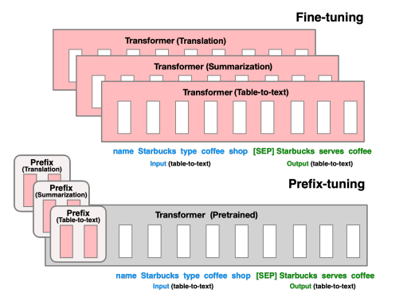
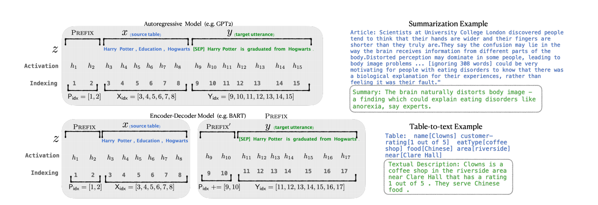
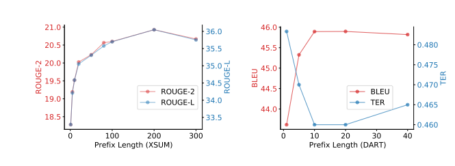
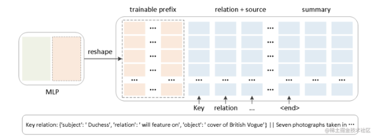
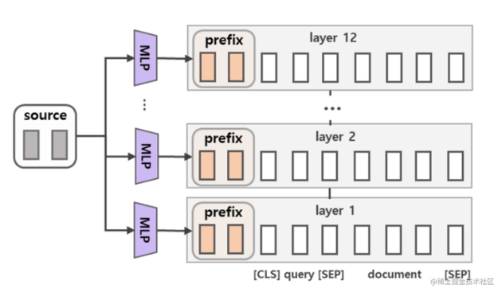

2101.00190v1

# 摘要

微调实际上是利用大型预训练过的语言模型来执行下游任务的一种方法。但是，它会修改所有的语言模型参数，因此需要为每个任务存储一个完整的副本。在本文中，我们提出了Prefix-Tuning（前缀调优），这是一种针对自然语言生成任务的轻量级替代方法，它可以保持语言模型参数冻结，但优化了一个连续特定任务的小向量（称为前缀）。前缀调优从prompting（提示）中获得灵感，允许后续的令牌像关注“虚拟令牌”一样关注这个前缀。我们将前缀调优应用于GPT-2进行table-to-text（表到文本）生成，并对BART进行总结生成。我们发现，通过只学习0.1%的参数，前缀调优在完整的数据设置中获得了可比较的性能，在低数据设置中优于微调，并更好地外推到在训练中看不到的主题的示例。

## 导言

在本文中，我们提出了前缀调优，这是一种针对自然语言生成（NLG）任务进行微调的轻量级替代方案，灵感来自prompt（提示）。例如生成文本的任务。任务输入是线性化的表（例如，“名称：星巴克|类型：咖啡店”），输出是文本描述（例如，“星巴克提供咖啡”）。前缀调优在输入前添加了一系列连续的任务特定的向量序列，我们称之为前缀，由图1（底部）中的红色块表示。对于后续的标记，变压器可以关注前缀，就好像它是一个“虚拟标记”的序列，但与prompting（提示）不同的是，前缀完全由自由参数组成，它们不对应于真正的tokens（标记）。图1（上图）中的微调更新了所有的变压器参数，因此需要为每个任务存储一个调优的模型副本，与此相反，前缀调优只优化了前缀。因此，我们只需要存储一个大型Transformer的副本和一个学习到的特定于任务的前缀，从而为每个额外的任务产生非常小的开销(例如，

顶部：微调更新所有Transformer参数（红色Transformer框），并需要为每个任务存储一个完整的模型副本。

底部：我们提出了前缀调优，它冻结了变压器的参数，并且只优化了前缀（红色的前缀块）。因此，我们只需要为每个任务存储前缀，使前缀调优模块化和空间效率。请注意，每个垂直方块表示transformer在一个时间步长上的激活情况。

## Prefix-Tuning

### Intuition

基于prompting（提示）的直觉，我们相信拥有一个适当的上下文可以在不改变LM参数的情况下引导LM。例如，如果我们希望LM生成一个单词（例如，Obama），我们可以将它的公共组合作为上下文（例如，Barack），并且LM将为所需的单词分配更高的概率。将这种直觉扩展到生成单个单词或句子之外，我们希望找到一个引导LM解决NLG任务的上下文。直观地说，上下文可以通过指导从x中提取的内容来影响x的编码；并可以通过指导下一个令牌分布来影响y的生成。然而，这种上下文是否存在并不明显。自然语言任务指令（例如，“用一个句子总结下表”）可能会指导专家注释器解决任务，但对于大多数预先训练的lm都失败了。2对离散指令的数据驱动优化可能会有所帮助，但离散优化在计算上具有挑战性。

我们不能优化离散的标记，而是可以将指令优化为连续的单词嵌入，其效果将向上传播到所有的变压器激活层，并向右传播到后续的标记。这严格比需要匹配真实单词的离散提示更具表现力。同时，这不会干预所有激活层的表达性，它避免了长期依赖，并包含了更多的可调参数。因此，前缀调优优化了前缀的所有层。

### Method

前缀调优在自回归LM的前缀前获得$z=[PREFIX;x;y]$，或者在编码器和编码器的前缀前获得$z=[PREFIX;x;PREFIX';y]$；x；PREFIX0；y]。这里，$P_{idx}$表示前缀索引的序列，我们使用$|P_{idx}|$来表示前缀的长度。我们遵循公式(1)中的递归关系，除了前缀是自由参数。

前缀调优初始化一个维数$|P_{idx}|×dim(h_i)$的可训练矩阵$P_θ$（由θ参数化）来存储前缀参数。

其中，$h_i$的最后一层用于计算下一个令牌的分布：$p_\phi(z_{i+1}|h_{≤i})=softmax(W \phi h_i^{(n)})$，Wφ是一个预先训练的矩阵，将$h_i^{(n)}$映射到词汇表的logits。

训练目标与式(2)相同，但可训练参数集发生了变化：语言模型参数φ为固定参数，前缀参数θ是唯一的可训练参数。

在微调框架中，我们使用预先训练好的参数φ进行初始化。这里的pφ是一个可训练的语言模型分布，我们对以下对数似然目标执行梯度更新

一个使用自回归LM（顶部）和编码器-解码器模型（底部）进行前缀调优的注释示例。

### Prefix 具体添加到模型的哪部分？

prefix tuning将prefix参数（可训练的张量）添加到所有的transformer层

机制：将多个prompt vectors 放在每个multi-head attention的key矩阵和value矩阵之前

计算方式：相当于原始的token要多和这些soft prompt token计算相似度，然后聚合。

## 实验

### Prefix Length

较长的前缀意味着更多的可训练参数，因此更具有表达能力。图4显示，随着前缀长度增加到一个阈值（摘要为200，表到文本为10），性能就会提高，然后性能就会略有下降。根据经验上，较长的前缀对推理速度的影响可以忽略不计，因为整个前缀的注意力计算在gpu上是并行化的。

摘要的前缀长度和性能（左）和table-to-text的前缀长度和性能（右）。随着前缀长度增加到一个阈值（摘要为200，表到文本为10），性能就会提高，然后性能就会略有下降。每个地块都报告两个度量值（在两个垂直轴上）。

### Full vs Embedding-only

discrete prompting< embedding-only ablation < prefifix-tuning（离散提示<仅嵌入的消融<前缀调优）

同时，为了防止直接更新 Prefix 的参数导致训练不稳定和性能下降的情况，在 Prefix 层前面加了 MLP 结构，训练完成后，只保留 Prefix 的参数。

除此之外，通过消融实验证实，只调整embedding层的表现力不够，将导致性能显著下降，因此，在每层都加了prompt的参数，改动较大。

