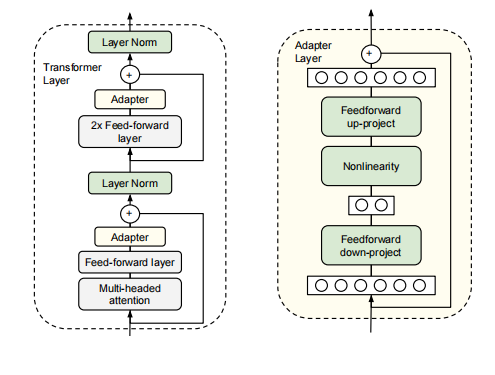

1902.00751v2

# 摘要

对大型预训练模型进行微调是自然语言处理中一种有效的传递机制。然而，在存在许多下游任务的情况下，微调是参数效率较低的：每个任务都需要一个全新的模型。**作为一种替代方案，我们建议使用适配器模块进行传输。适配器模块产生一个紧凑和可扩展的模型；它们每个任务只添加一些可训练参数，可以添加新的任务而无需重新访问以前的任务。原网络的参数保持不变，产生了高度的参数共享。**为了证明适配器的有效性，我们将最近提出的BERT变压器模型转移到26个不同的文本分类任务中，包括GLUE基准测试。Adapters达到接近最先进的性能，同时每个任务只添加几个参数。在GLUE上，我们获得了完全微调性能的0.4%以内，每个任务只添加3.6%的参数。相比之下，微调训练每个任务的100%的参数。

## 导言

文章总体的思路就是设计了一个adapter（类似适配器）将预训练模型微调的参数从原先的整个大模型，到只需要训练几个小的适配器，就能够达到和原先做法在下游任务差不多的效果，大大减少了模型训练的参数，提高了效率。

## Adapter tuning for NLP

我们提出了一个在几个下游任务上调优大型文本模型的策略。我们的策略有三个关键属性： 

1. 它获得了良好的性能

2. 它允许按顺序对任务进行训练，也就是说，它不需要同时访问所有数据集，

3. 它只为每个任务添加了少量的额外参数。

这些属性在云服务的上下文中特别有用，在云服务中，许多模型需要对一系列下游任务进行训练，因此需要进行高度的共享。

**在标准的微调中，新的顶层和原始的权重是共同训练的。相比之下，在适配器调优中，原始网络的参数被冻结，因此可能被许多任务共享。**

**适配器模块有两个主要特性：少量的参数和一个接近标识的初始化。**

左：我们向每个Transformer层添加两次适配器模块：在多头注意之后的投影之后，在两个前馈层之后。

右：adapter包含一个bottleneck（瓶颈），它包含了相对于原始模型中的注意力和前馈层的少量参数。该适配器还包含一个跳过连接。在适配器调优过程中，绿色层会对下游数据进行训练，这包括适配器、层的归一化参数和最终的分类层（图中未显示）。

