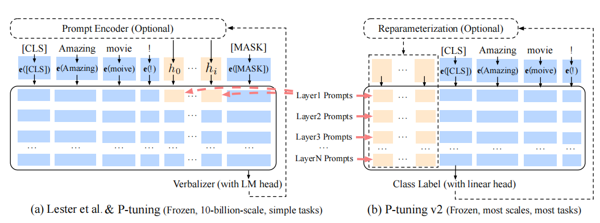

2110.07602v2

# 摘要

Prompt tuning（**提示调优），即只使用冻结的语言模型来调优连续的提示，它大大减少了训练中每个任务的存储和内存使用**。然而，在NLU的背景下，先前的工作表明，提示调优对于正常大小的预训练模型表现不佳。我们还发现，现有的提示调优方法不能处理硬序列标记任务，这表明缺乏通用性。我们提出了一个新的经验发现，即适当优化的提示调优可以在广泛的模型尺度和NLU任务中普遍有效。它与微调的性能相匹配，而只有0.1%-3%的调整参数。我们的方法P-Tuning v2并不是一种新方法，而是前缀调优优化和适应NLU（Li和Liang，2021）的一个版本。鉴于P-Tuning v2的普遍性和简单性，我们相信它可以作为一种微调的替代方案，并为未来的研究提供了一个强有力的基线。

## 导言

从技术上讲，我们的方法P-tuningv2可以看作是prefifix-tuning的优化版本，这是一种为生成而设计并适用于NLU的方法。**最显著的改进来自于使用deep prompt tuning（深度提示调优），即对预训练模型的每一层都应用连续的提示**。深度提示调优增加了连续提示的能力，并缩小了在各种设置中进行微调的差距，特别是对于小模型和硬任务。此外，我们提出了一些优化和实现的细节，以进一步增强结果。

## P-Tuning v2

Prompt tuning and P-tuning在许多NLP应用程序中已经被证明是相当有效的。然而，考虑到以下缺乏普遍性，p调优还不是一个全面的替代微调。

- Lack of universality across scales.（缺乏跨尺度的普遍性）

- Lack of universality across tasks（在各个任务之间缺乏普遍性）

在P-tuning中，连续的提示只被插入到输入嵌入的序列中为变压器的第一层。在下面的变压器层中，插入连续提示的位置的嵌入由以前的变压器层计算，这可能会导致两个可能的优化挑战。

- 要调整的参数数量有限。大多数语言模型目前只能支持最大序列长度的512（由于注意力的二次计算复杂度的成本）。如果我们额外扣除上下文的长度（例如，一个要分类的句子），我们可以用连续的提示填充的长度是有限的。 

- 当使用极深的变压器进行调谐时，其稳定性有限。随着变压器的深入，由于许多中间层的计算（具有非线性激活函数），来自第一层的提示的影响可能是意料之外的，这使得我们的优化不是非常平滑的。

鉴于这些挑战，P-tuingv2利用了多层提示（即deep prompt tuning（深度提示调优））像prefix-tuning，作为对P-tuning和prefix-tuning的重大改进。不同层中的提示作为输入序列中的前缀标记添加，并且彼此独立于其他中间层（而不是由以前的转换器层计算）。一方面，通过这种方式，P-tuning v2有更多的可调任务特定参数（从0.01%到0.1%-3%），以允许更多的每个任务容量，而它仍然比完整的预训练语言模型小得多；另一方面，添加到更深层次的提示可以使用更少的中间变压器层对输出预测产生更直接和显著的影响。

橙色标记（包括h0，hi）是指我们添加的prompt embeddings（提示嵌入）；蓝色标记是由冻结的预先训练过的语言模型存储或计算的嵌入。**与P-tuning相比，P-tuning v2为每个transformer层独立添加可训练的连续的输入提示(正如prefix-tuning（Li和Liang，2021）所做的那样）。此外，P-tuning v2删除了带有LM头的表达器，并返回到带有普通线性头的传统类标签，以允许其任务普遍性。**

### 优化和实现

- Reparameterization（优化：重新参数化）：以前的方法利用重新参数化函数来提高训练速度、鲁棒性和性能（例如，MLP用于前缀调优和LSTM用于P-tuning）。然而，对于NLU任务，我们发现这种技术的好处取决于任务和数据集。对于一些数据集（例如，RTE和CoNLL04），MLP重新参数化比嵌入带来了一致的改进；对于其他数据集，重新参数化可能没有显示出影响（例如，BoolQ），有时甚至更糟（例如，CoNLL12）。

- Prompt length（优化：提示长度）：提示长度在提示调优方法的超参数搜索中起着核心作用。在我们的实验中，我们发现不同的理解任务通常在不同的提示长度下达到最佳的性能，这与prefix-tuning（Li和Liang，2021）的发现一致，不同的文本生成任务可能有不同的最佳提示长度。

- Multi-task learning（优化：多任务学习）：多任务学习对于我们的方法来说是可选的，但可能会很有帮助。一方面，连续提示的随机初始化带来了优化的差异，可以通过更多的训练数据或与任务相关的无监督预训练来缓解这种差异；另一方面，连续提示作为跨任务和数据集的任务特定知识的完美载体。我们的实验表明，多任务学习可以作为一些硬序列任务中P-tuning v2的有用补充，即MPT-2

- [CLS] and token classifification, rather than verbalizers（实现：[CLS]和令牌分类，而不是语言器）：表达器（Schick和Schutze，2020）一直是提示调优的核心组成部分，它将一个热门的类标签转换为有意义的单词，以利用预先训练的语言模型头。尽管在few-shot设置中具有潜在的必要性，但在全数据监督设置中不是必须的。它阻碍了在我们需要无实际意义的标签和句子嵌入的场景中进行提示调优的应用。因此，P-tuning v2返回到传统的[CLS]标签分类具有随机初始化的线性磁头的范式

