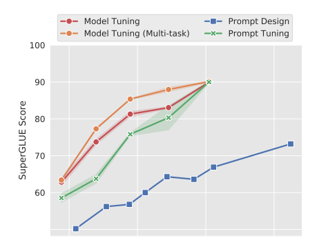
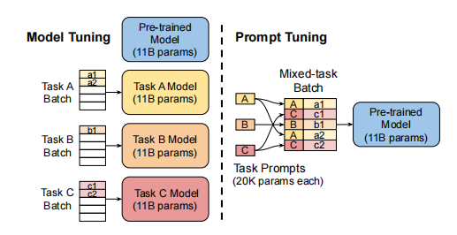
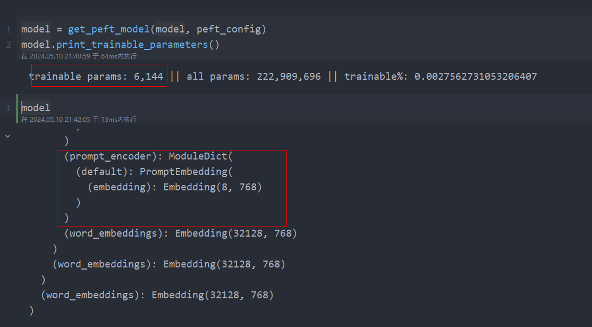

2104.08691v2

# 摘要

在这项工作中，我们探索了“prompt tuning（提示调优）”，这是一种简单而有效的机制，用于学习“soft prompts（软提示）”，以条件下冻结的语言模型来执行特定的下游任务。**与GPT-3使用的离散文本提示不同，软提示是通过反向传播来学习的，并且可以进行调优，以合并来自任意数量的标记示例的信号。**我们的端到端学习方法比GPT-3的少量镜头学习效果更好。更值得注意的是，通过使用T5对模型大小进行消融，我们证明了提示调优随着规模的增加而变得更有竞争力：随着模型超过数十亿参数，我们的方法“缩小差距”，并匹配模型调优的强大性能（其中所有模型权重都被调优）。这一发现特别相关，因为大型模型的共享和服务成本很高，而为多个下游任务重用一个冻结模型的能力可以减轻这种负担。我们的方法可以看作是对Li和Liang（2021）最近提出的“前缀调优”的简化，并与这种方法和其他类似的方法进行了比较。最后，我们展示了使用软提示条件处理冻结模型有利于域转移的鲁棒性，并能够实现高效的“提示集成”。

## 导言

- ELMo（Peters et al.，2018）提出冻结预先训练好的模型，并学习其每层表示的任务特定权重。

- GPT和BERT主导的适应技术是模型调整（或“微调”），在适应过程中所有模型参数都被调整

- T5的标准模型调优实现了很强的性能，但需要为每个结束任务存储单独的单独副本。

最近，Brown等人（2020）表明，**prompt design**（提示设计）（或“priming”）通过文本提示调节冻结的GPT-3模型的行为是惊人的有效的。提示通常由一个任务描述和/或几个规范示例组成。这种对“冻结”预训练模型的回归是很有吸引力的，特别是随着模型规模的不断增加。一个单一的通用模型可以同时服务于许多不同的任务，而不是为每个下游任务需要一个单独的模型副本。

不幸的是，基于提示的适应有几个关键的缺点。任务描述容易出错，需要人类的参与，而提示的有效性受到模型输入中有多少条件反射文本的限制。因此，下游任务的质量仍然远远落后于调优后的模型。

在本文中，我们提出了prompt tuning（提示调优），作为自适应语言模型的进一步简化。我们冻结了整个预先训练过的模型，并且只允许每个下游任务在输入文本中添加额外的k个可调标记。这种“soft prompt（软提示）”是端到端训练的，可以压缩来自完整标记数据集的信号，使我们的方法优于few-shot prompts，并通过模型调优缩小质量差距。与此同时，由于单个预先训练过的模型可以被循环用于所有下游任务，因此我们保留了冻结模型的有效服务好处。

总之，我们的主要贡献是：

1. 在大型语言模型体系中提出快速调优并显示其与模型调优的竞争力。 

2. 去除许多设计选择，并显示质量和鲁棒性随着规模的扩大而提高。 

3. 在域移位问题上，prompt tuning调优优于模型调优。 

4. 提出“prompt ensembling（提示集成）”，并显示其有效性。

## Prompt Tuning

遵循T5的“text-to-text”方法，我们将所有任务转换为文本生成。我们不是将分类建模为给定一些输入的输出类的概率，$Pr（y|X）$，其中X是一系列标记，y是一个单一的类标签，**我们现在将其建模为条件生成**，其中Y是一个表示类标签的token序列。T5模型分类为$Pr _\theta（Y |X）$，由组成其编码器和解码器的变压器的权重θ参数化。

Prompting是在模型生成Y的过程中为模型添加额外信息的方法。

Prompt tuning消除了提示P被θ参数化的限制；相反，提示符有它自己的专用参数，$θ_P$，可以更新。prompt tuning可以被认为是使用特殊的固定提示，其中只能对这些prompt tokens的embeddings进行更新，而prompt  design涉及从冻结嵌入的固定词汇表中选择prompt tokens。我们的新的条件生成现在是$Pr_{θ;θ_P}(Y|[P;X])$，可以通过反向传播最大化Y的可能性来训练，而只对$θ_P$应用梯度更新。

给定一系列的n个标记，$\{x1,x2,…,xn\}$，T5所做的第一件事就是嵌入令牌，形成一个矩阵$X_e ∈ R^{n×e}$，其中，e为embedding空间的维数。我们的soft-prompts被表示为一个参数$P_e ∈ R^{p×e} $，其中，p是prompt的长度。然后将我们的提示符连接到embedded的输入中，形成一个单一的矩阵$[P_e; X_e] ∈ R^{(p+n)×e}$，然后正常地通过编解码器。我们的模型被训练以使Y的概率最大化，但只有提示参数$P_e$被更新。

Model tuning（模型调优）需要为每个下游任务的整个预训练模型制作一个特定于任务的副本，并且推理必须在单独的批次中执行。

Prompt tuning（提示调优）只需要为每个任务存储一个特定于任务的小提示，并使用原始的预训练模型启用混合任务推理。对于T5“XXL”模型，每个调优模型的副本需要110亿个参数。相比之下，我们调整后的提示每个任务只需要20,480个参数——减少了超过5个数量级——假设提示长度为5个令牌。

### Design Decisions

有许多可能的方法来初始化提示符表示法。最简单的方法是使用随机初始化从头开始训练。一个更复杂的选择是将每个提示标记初始化为从模型的词汇表中提取的嵌入。从概念上讲，我们的软提示以与输入前的文本相同的方式调节冻结网络的行为，因此，一个类似单词的表示可以作为一个很好的初始化点。对于分类任务，第三个选项是使用枚举输出类的嵌入来初始化提示符，类似于Schick和Schutze（2021）的“语言表达器”。由于我们希望模型在输出中生成这些标记，因此使用有效目标标记的嵌入来初始化提示符应该会启动模型，从而将其输出限制为合法的输出类。

另一个设计上考虑的因素是提示符的长度。该方法的参数代价为EP，其中E为标记嵌入维数，P为提示符长度。提示符越短，必须调整的新参数就越少，因此我们的目标是找到一个仍然表现良好的最小长度。

## Prompt Tuning和T5区别

- Prompt Tuning使用预训练模型微调；T5是训练预训练模型。

- Prompt Tuning输入：提示词+原输入进入 【提示词embedding（训练）+原输入embedding（冻结）】；    

- T5输入：提示词+原输入进入embedding；

num_virtual_tokens：8为要使用的虚拟令牌的数量。

